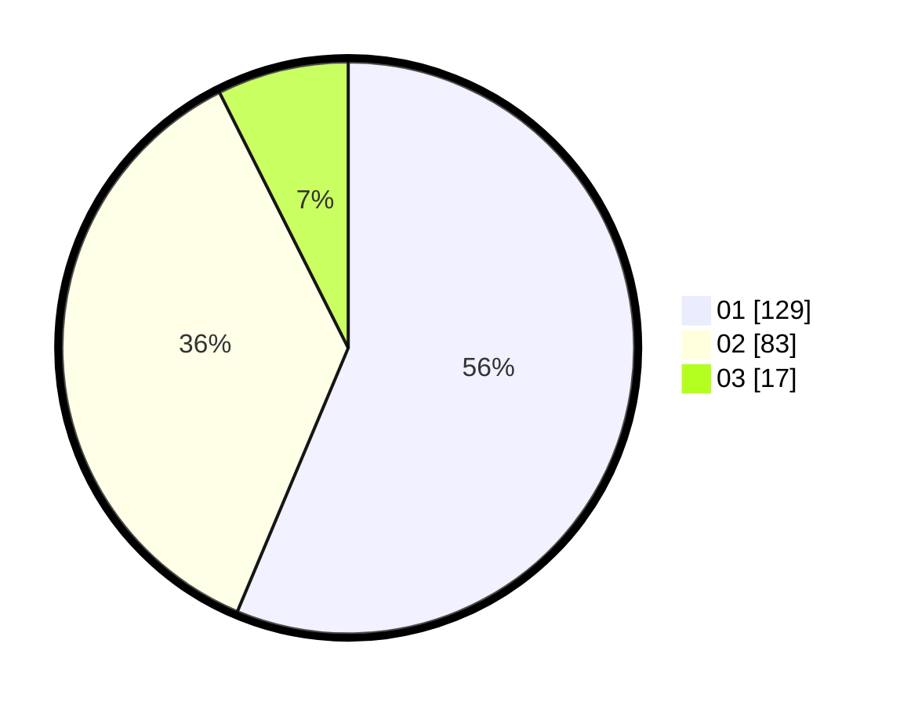

# Hasil

Hasil perolehan suara paslon dapat dilihat pada file paslon-01.txt, paslon-02.txt, dan paslon-03.txt.

Jika tidak ada, artinya data tersebut belum ada pada SIREKAP.

## Perolehan Suara

 * Paslon 01: **129**.
 * Paslon 02: **83**.
 * Paslon 03: **17**.

## Foto C Plano

https://sirekap-obj-formc.kpu.go.id/1628/pemilu/ppwp/31/75/04/10/07/3175041007048-20240216-193051--c602b1b8-9055-4c74-ba57-025b39eadcb6.jpg

https://sirekap-obj-formc.kpu.go.id/1628/pemilu/ppwp/31/75/04/10/07/3175041007048-20240216-193052--8cfbd65b-358d-4196-b582-90336609ce3b.jpg

https://sirekap-obj-formc.kpu.go.id/1628/pemilu/ppwp/31/75/04/10/07/3175041007048-20240216-193052--9fe1b9e9-75a1-4d4b-9d3b-c3403039938d.jpg

## DATA PEMILIH TETAP

Jumlah pemilih dalam DPT: **294**.
 * L: **146**.
 * P: **148**.

## DATA PENGGUNA HAK PILIH

Jumlah pengguna hak pilih dalam DPT: **227**.
 * L: **111**.
 * P: **116**.

Jumlah pengguna hak pilih dalam DPTb: **7**.
 * L: **1**.
 * P: **6**.

Jumlah pengguna hak pilih dalam DPK: **1**.
 * L: **0**.
 * P: **1**.

Jumlah pengguna hak pilih: **235**.
 * L: **112**.
 * P: **123**.

## JUMLAH SUARA SAH DAN TIDAK SAH

JUMLAH SELURUH SUARA SAH: **229**.

JUMLAH SUARA TIDAK SAH: **6**.

JUMLAH SELURUH SUARA SAH DAN SUARA TIDAK SAH: **235**.
