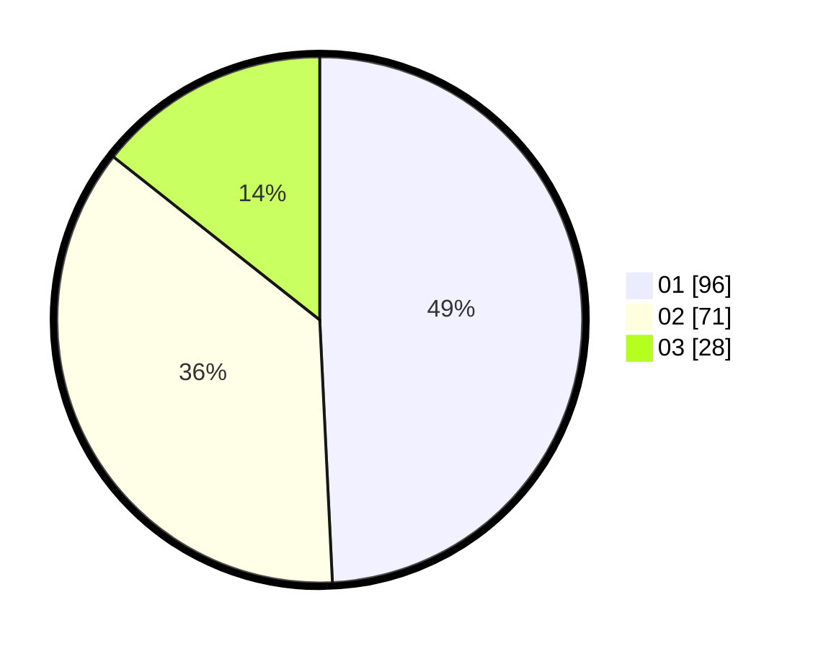

# Hasil

Hasil perolehan suara paslon dapat dilihat pada file paslon-01.txt, paslon-02.txt, dan paslon-03.txt.

Jika tidak ada, artinya data tersebut belum ada pada SIREKAP.

## Perolehan Suara

 * Paslon 01: **96**.
 * Paslon 02: **71**.
 * Paslon 03: **28**.

## Foto C Plano

https://sirekap-obj-formc.kpu.go.id/1e41/pemilu/ppwp/31/75/04/10/07/3175041007052-20240215-211755--748fe464-d6aa-4297-8d26-dedf10e17d4a.jpg

https://sirekap-obj-formc.kpu.go.id/1e41/pemilu/ppwp/31/75/04/10/07/3175041007052-20240215-211757--9f082826-724b-49f8-8c79-5ecd02d81608.jpg

https://sirekap-obj-formc.kpu.go.id/1e41/pemilu/ppwp/31/75/04/10/07/3175041007052-20240215-211756--ccf6b772-e42f-40a7-8a2c-f8943beadaf3.jpg

## DATA PEMILIH TETAP

Jumlah pemilih dalam DPT: **271**.
 * L: **126**.
 * P: **145**.

## DATA PENGGUNA HAK PILIH

Jumlah pengguna hak pilih dalam DPT: **186**.
 * L: **79**.
 * P: **107**.

Jumlah pengguna hak pilih dalam DPTb: **6**.
 * L: **6**.
 * P: **0**.

Jumlah pengguna hak pilih dalam DPK: **5**.
 * L: **0**.
 * P: **5**.

Jumlah pengguna hak pilih: **197**.
 * L: **85**.
 * P: **112**.

## JUMLAH SUARA SAH DAN TIDAK SAH

JUMLAH SELURUH SUARA SAH: **195**.

JUMLAH SUARA TIDAK SAH: **2**.

JUMLAH SELURUH SUARA SAH DAN SUARA TIDAK SAH: **197**.
