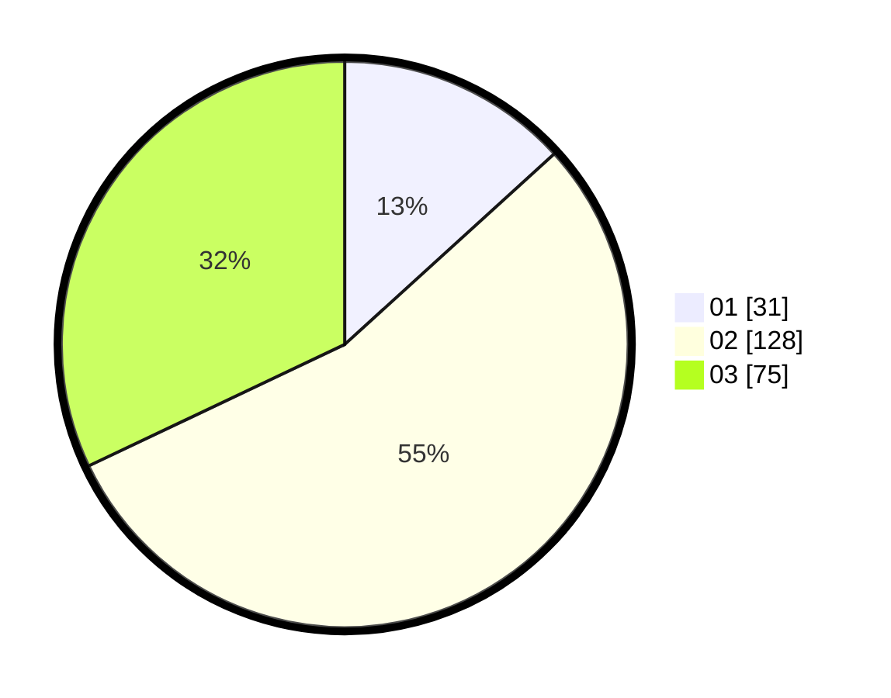

# Hasil

Hasil perolehan suara paslon dapat dilihat pada file paslon-01.txt, paslon-02.txt, dan paslon-03.txt.

Jika tidak ada, artinya data tersebut belum ada pada SIREKAP.

## Perolehan Suara

 * Paslon 01: **31**.
 * Paslon 02: **128**.
 * Paslon 03: **75**.

## Foto C Plano

https://sirekap-obj-formc.kpu.go.id/6dde/pemilu/ppwp/31/75/04/10/07/3175041007057-20240215-014344--75adef84-6c8e-4484-a676-1ad6c171a80d.jpg

https://sirekap-obj-formc.kpu.go.id/6dde/pemilu/ppwp/31/75/04/10/07/3175041007057-20240215-002803--88290f54-d1dd-4c7d-8c53-11f95b015e76.jpg

https://sirekap-obj-formc.kpu.go.id/6dde/pemilu/ppwp/31/75/04/10/07/3175041007057-20240215-002855--699af60d-f3e6-4476-ae07-9564bd5eab9f.jpg

## DATA PEMILIH TETAP

Jumlah pemilih dalam DPT: **282**.
 * L: **141**.
 * P: **141**.

## DATA PENGGUNA HAK PILIH

Jumlah pengguna hak pilih dalam DPT: **123**.
 * L: **411**.
 * P: **312**.

Jumlah pengguna hak pilih dalam DPTb: **82**.
 * L: **801**.
 * P: **1**.

Jumlah pengguna hak pilih dalam DPK: **1**.
 * L: **0**.
 * P: **1**.

Jumlah pengguna hak pilih: **237**.
 * L: **114**.
 * P: **123**.

## JUMLAH SUARA SAH DAN TIDAK SAH

JUMLAH SELURUH SUARA SAH: **234**.

JUMLAH SUARA TIDAK SAH: **3**.

JUMLAH SELURUH SUARA SAH DAN SUARA TIDAK SAH: **237**.
