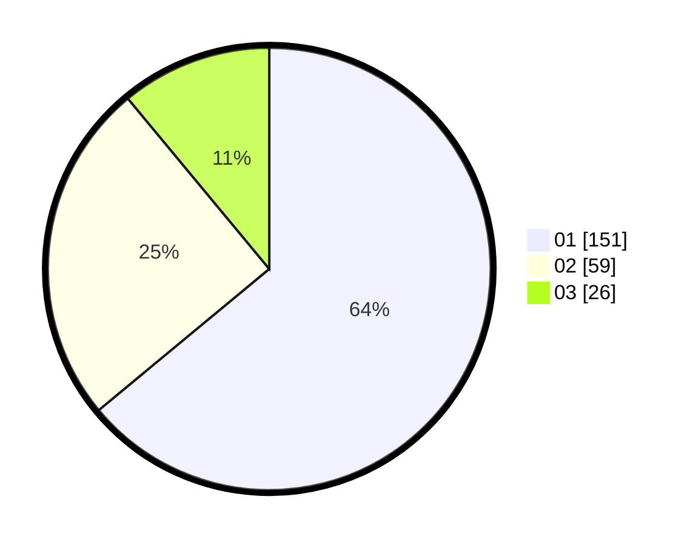

# Hasil

Hasil perolehan suara paslon dapat dilihat pada file paslon-01.txt, paslon-02.txt, dan paslon-03.txt.

Jika tidak ada, artinya data tersebut belum ada pada SIREKAP.

## Perolehan Suara

 * Paslon 01: **151**.
 * Paslon 02: **59**.
 * Paslon 03: **26**.

## Foto C Plano

https://sirekap-obj-formc.kpu.go.id/399b/pemilu/ppwp/31/75/04/10/07/3175041007058-20240214-230805--3df6690b-713b-4e1b-84e0-814a6c1ae267.jpg

https://sirekap-obj-formc.kpu.go.id/399b/pemilu/ppwp/31/75/04/10/07/3175041007058-20240214-230853--f71bdedb-55c9-43a5-923e-dc01748e3089.jpg

https://sirekap-obj-formc.kpu.go.id/399b/pemilu/ppwp/31/75/04/10/07/3175041007058-20240214-231054--2188d80e-3028-464c-a173-90eec257603e.jpg

## DATA PEMILIH TETAP

Jumlah pemilih dalam DPT: **280**.
 * L: **134**.
 * P: **146**.

## DATA PENGGUNA HAK PILIH

Jumlah pengguna hak pilih dalam DPT: **231**.
 * L: **106**.
 * P: **125**.

Jumlah pengguna hak pilih dalam DPTb: **2**.
 * L: **1**.
 * P: **1**.

Jumlah pengguna hak pilih dalam DPK: **4**.
 * L: **3**.
 * P: **1**.

Jumlah pengguna hak pilih: **237**.
 * L: **110**.
 * P: **127**.

## JUMLAH SUARA SAH DAN TIDAK SAH

JUMLAH SELURUH SUARA SAH: **236**.

JUMLAH SUARA TIDAK SAH: **1**.

JUMLAH SELURUH SUARA SAH DAN SUARA TIDAK SAH: **237**.
