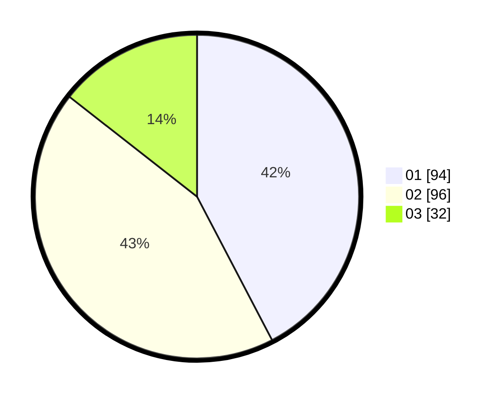

# Hasil

Hasil perolehan suara paslon dapat dilihat pada file paslon-01.txt, paslon-02.txt, dan paslon-03.txt.

Jika tidak ada, artinya data tersebut belum ada pada SIREKAP.

## Perolehan Suara

 * Paslon 01: **94**.
 * Paslon 02: **96**.
 * Paslon 03: **32**.

## Foto C Plano

https://sirekap-obj-formc.kpu.go.id/1881/pemilu/ppwp/31/75/04/10/07/3175041007062-20240216-173828--c9754ef2-e9c0-4230-8810-d58ae0c0294a.jpg

https://sirekap-obj-formc.kpu.go.id/1881/pemilu/ppwp/31/75/04/10/07/3175041007062-20240218-141142--913b586b-b33d-4420-abbb-690d1ae0ada4.jpg

https://sirekap-obj-formc.kpu.go.id/1881/pemilu/ppwp/31/75/04/10/07/3175041007062-20240216-175925--164a0fe6-3944-48b9-a1e3-8563a3abef4e.jpg

## DATA PEMILIH TETAP

Jumlah pemilih dalam DPT: **277**.
 * L: **136**.
 * P: **141**.

## DATA PENGGUNA HAK PILIH

Jumlah pengguna hak pilih dalam DPT: **232**.
 * L: **111**.
 * P: **121**.

Jumlah pengguna hak pilih dalam DPTb: **0**.
 * L: **0**.
 * P: **0**.

Jumlah pengguna hak pilih dalam DPK: **0**.
 * L: **0**.
 * P: **0**.

Jumlah pengguna hak pilih: **232**.
 * L: **111**.
 * P: **121**.

## JUMLAH SUARA SAH DAN TIDAK SAH

JUMLAH SELURUH SUARA SAH: **222**.

JUMLAH SUARA TIDAK SAH: **10**.

JUMLAH SELURUH SUARA SAH DAN SUARA TIDAK SAH: **232**.
