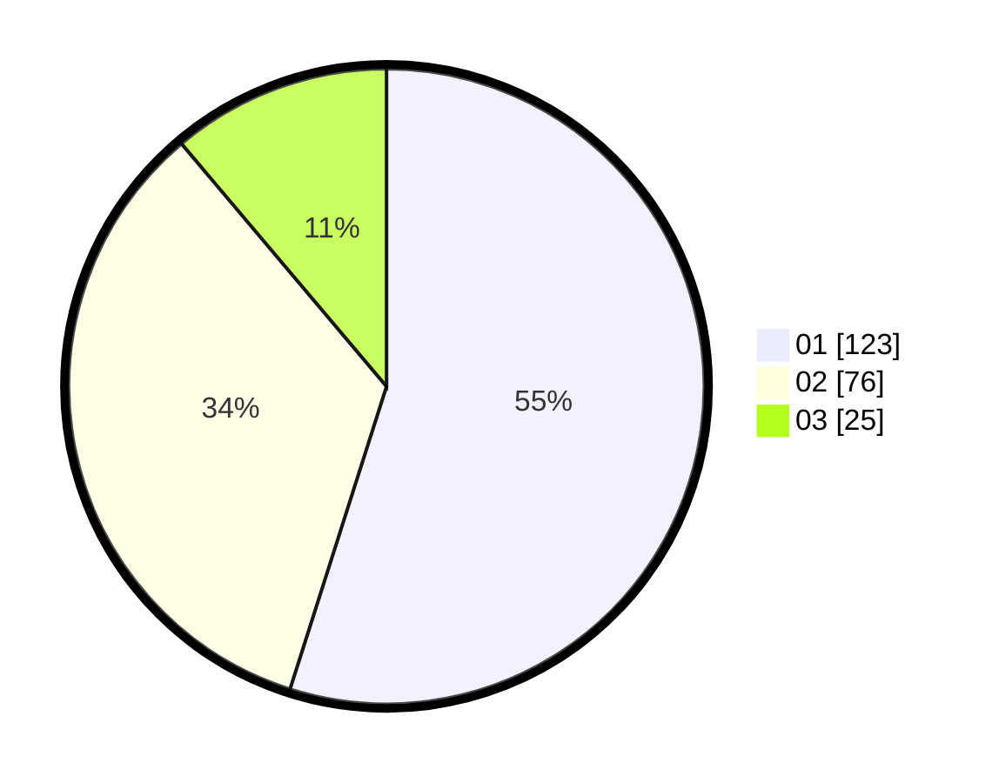

# Hasil

Hasil perolehan suara paslon dapat dilihat pada file paslon-01.txt, paslon-02.txt, dan paslon-03.txt.

Jika tidak ada, artinya data tersebut belum ada pada SIREKAP.

## Perolehan Suara

 * Paslon 01: **123**.
 * Paslon 02: **76**.
 * Paslon 03: **25**.

## Foto C Plano

https://sirekap-obj-formc.kpu.go.id/5a3f/pemilu/ppwp/31/75/04/10/07/3175041007064-20240215-102446--0f1c2cf5-f283-48d6-9bfc-dbf6755f4113.jpg

https://sirekap-obj-formc.kpu.go.id/5a3f/pemilu/ppwp/31/75/04/10/07/3175041007064-20240215-102508--d8766ffd-248f-433a-b466-9d3a79022326.jpg

https://sirekap-obj-formc.kpu.go.id/5a3f/pemilu/ppwp/31/75/04/10/07/3175041007064-20240215-102457--291feb60-6d61-475a-a3af-791183a58823.jpg

## DATA PEMILIH TETAP

Jumlah pemilih dalam DPT: **278**.
 * L: **145**.
 * P: **133**.

## DATA PENGGUNA HAK PILIH

Jumlah pengguna hak pilih dalam DPT: **234**.
 * L: **116**.
 * P: **118**.

Jumlah pengguna hak pilih dalam DPTb: **0**.
 * L: **0**.
 * P: **0**.

Jumlah pengguna hak pilih dalam DPK: **0**.
 * L: **0**.
 * P: **0**.

Jumlah pengguna hak pilih: **234**.
 * L: **116**.
 * P: **118**.

## JUMLAH SUARA SAH DAN TIDAK SAH

JUMLAH SELURUH SUARA SAH: **224**.

JUMLAH SUARA TIDAK SAH: **10**.

JUMLAH SELURUH SUARA SAH DAN SUARA TIDAK SAH: **234**.
