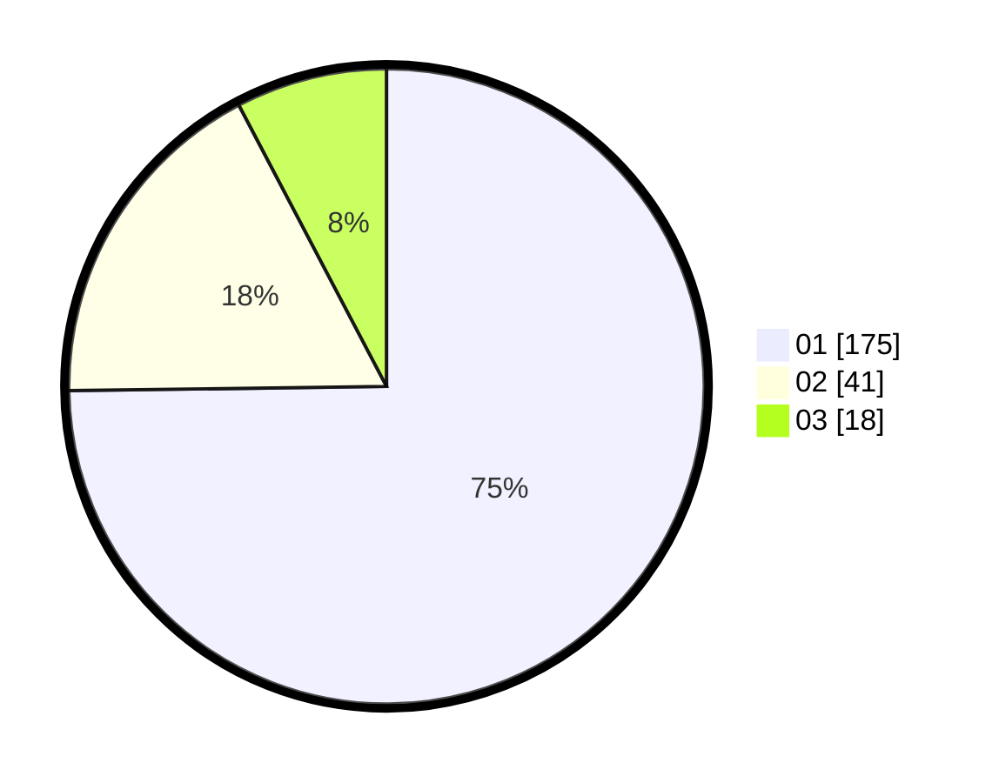

# Hasil

Hasil perolehan suara paslon dapat dilihat pada file paslon-01.txt, paslon-02.txt, dan paslon-03.txt.

Jika tidak ada, artinya data tersebut belum ada pada SIREKAP.

## Perolehan Suara

 * Paslon 01: **175**.
 * Paslon 02: **41**.
 * Paslon 03: **18**.

## Foto C Plano

https://sirekap-obj-formc.kpu.go.id/d2b4/pemilu/ppwp/31/75/04/10/07/3175041007067-20240214-230914--972a07c1-cbee-42c7-864a-f0f167d5fab6.jpg

https://sirekap-obj-formc.kpu.go.id/d2b4/pemilu/ppwp/31/75/04/10/07/3175041007067-20240214-230919--1cb65186-b235-47a9-99c5-86470670e40a.jpg

https://sirekap-obj-formc.kpu.go.id/d2b4/pemilu/ppwp/31/75/04/10/07/3175041007067-20240214-230922--ba498088-9548-4196-b558-701394171494.jpg

## DATA PEMILIH TETAP

Jumlah pemilih dalam DPT: **277**.
 * L: **127**.
 * P: **150**.

## DATA PENGGUNA HAK PILIH

Jumlah pengguna hak pilih dalam DPT: **229**.
 * L: **103**.
 * P: **126**.

Jumlah pengguna hak pilih dalam DPTb: **2**.
 * L: **1**.
 * P: **1**.

Jumlah pengguna hak pilih dalam DPK: **4**.
 * L: **4**.
 * P: **0**.

Jumlah pengguna hak pilih: **235**.
 * L: **108**.
 * P: **127**.

## JUMLAH SUARA SAH DAN TIDAK SAH

JUMLAH SELURUH SUARA SAH: **234**.

JUMLAH SUARA TIDAK SAH: **1**.

JUMLAH SELURUH SUARA SAH DAN SUARA TIDAK SAH: **235**.
