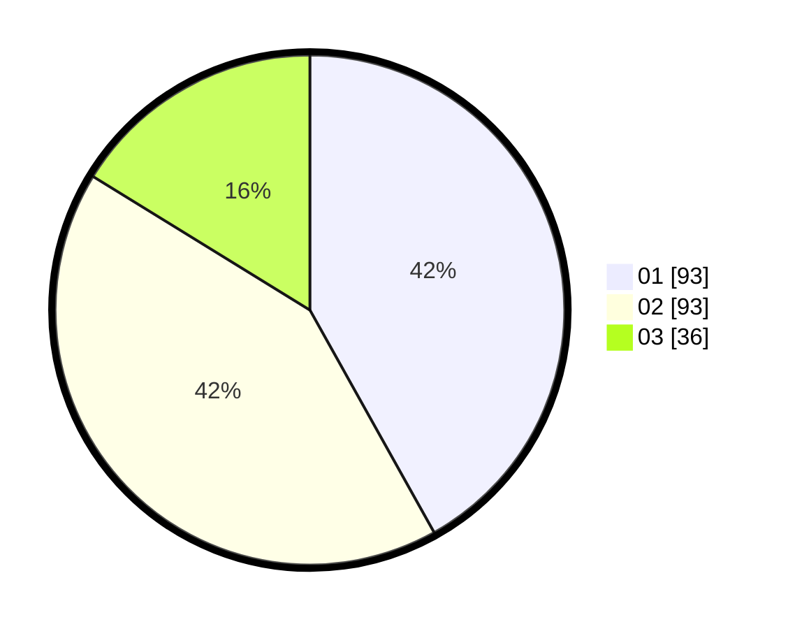

# Hasil

Hasil perolehan suara paslon dapat dilihat pada file paslon-01.txt, paslon-02.txt, dan paslon-03.txt.

Jika tidak ada, artinya data tersebut belum ada pada SIREKAP.

## Perolehan Suara

 * Paslon 01: **93**.
 * Paslon 02: **93**.
 * Paslon 03: **36**.

## Foto C Plano

https://sirekap-obj-formc.kpu.go.id/4526/pemilu/ppwp/31/75/04/10/07/3175041007076-20240216-190418--b0c4d3bc-1784-4dc4-a782-700ea1e2a121.jpg

https://sirekap-obj-formc.kpu.go.id/4526/pemilu/ppwp/31/75/04/10/07/3175041007076-20240216-190420--c272ce57-68da-444d-b25d-5c2547cdb320.jpg

https://sirekap-obj-formc.kpu.go.id/4526/pemilu/ppwp/31/75/04/10/07/3175041007076-20240216-190419--2e086421-af75-474d-9f1b-e230879b78b2.jpg

## DATA PEMILIH TETAP

Jumlah pemilih dalam DPT: **286**.
 * L: **138**.
 * P: **148**.

## DATA PENGGUNA HAK PILIH

Jumlah pengguna hak pilih dalam DPT: **219**.
 * L: **104**.
 * P: **115**.

Jumlah pengguna hak pilih dalam DPTb: **1**.
 * L: **1**.
 * P: **0**.

Jumlah pengguna hak pilih dalam DPK: **2**.
 * L: **0**.
 * P: **2**.

Jumlah pengguna hak pilih: **222**.
 * L: **105**.
 * P: **117**.

## JUMLAH SUARA SAH DAN TIDAK SAH

JUMLAH SELURUH SUARA SAH: **222**.

JUMLAH SUARA TIDAK SAH: **0**.

JUMLAH SELURUH SUARA SAH DAN SUARA TIDAK SAH: **222**.
