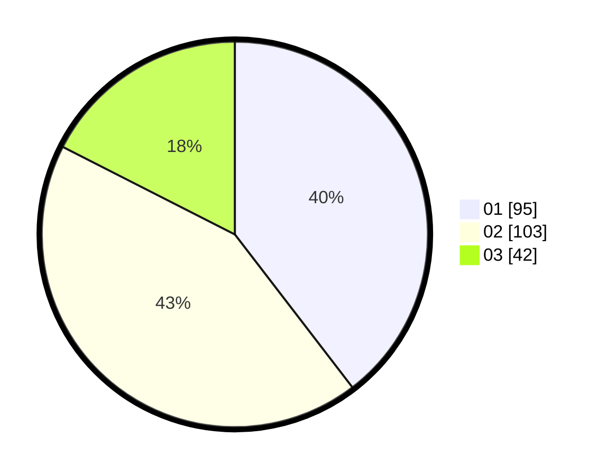

# Hasil

Hasil perolehan suara paslon dapat dilihat pada file paslon-01.txt, paslon-02.txt, dan paslon-03.txt.

Jika tidak ada, artinya data tersebut belum ada pada SIREKAP.

## Perolehan Suara

 * Paslon 01: **95**.
 * Paslon 02: **103**.
 * Paslon 03: **42**.

## Foto C Plano

https://sirekap-obj-formc.kpu.go.id/e51a/pemilu/ppwp/31/75/04/10/07/3175041007078-20240216-053312--e65dd268-65d1-4f36-b701-80858c764c1d.jpg

https://sirekap-obj-formc.kpu.go.id/e51a/pemilu/ppwp/31/75/04/10/07/3175041007078-20240216-053314--cfaa1e7d-5d89-4080-8add-4e412f557ed7.jpg

https://sirekap-obj-formc.kpu.go.id/e51a/pemilu/ppwp/31/75/04/10/07/3175041007078-20240216-053313--10ed7e96-7e56-44fe-b041-0a0a0ecbeb5e.jpg

## DATA PEMILIH TETAP

Jumlah pemilih dalam DPT: **0**.
 * L: **0**.
 * P: **0**.

## DATA PENGGUNA HAK PILIH

Jumlah pengguna hak pilih dalam DPT: **0**.
 * L: **0**.
 * P: **0**.

Jumlah pengguna hak pilih dalam DPTb: **0**.
 * L: **0**.
 * P: **0**.

Jumlah pengguna hak pilih dalam DPK: **0**.
 * L: **0**.
 * P: **0**.

Jumlah pengguna hak pilih: **0**.
 * L: **0**.
 * P: **0**.

## JUMLAH SUARA SAH DAN TIDAK SAH

JUMLAH SELURUH SUARA SAH: **240**.

JUMLAH SUARA TIDAK SAH: **6**.

JUMLAH SELURUH SUARA SAH DAN SUARA TIDAK SAH: **246**.
