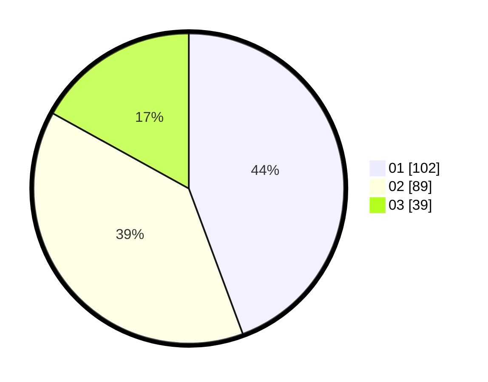

# Hasil

Hasil perolehan suara paslon dapat dilihat pada file paslon-01.txt, paslon-02.txt, dan paslon-03.txt.

Jika tidak ada, artinya data tersebut belum ada pada SIREKAP.

## Perolehan Suara

 * Paslon 01: **102**.
 * Paslon 02: **89**.
 * Paslon 03: **39**.

## Foto C Plano

https://sirekap-obj-formc.kpu.go.id/e044/pemilu/ppwp/31/75/04/10/07/3175041007079-20240215-000421--eaec9072-907c-4e27-b0a2-cce16e3a8995.jpg

https://sirekap-obj-formc.kpu.go.id/e044/pemilu/ppwp/31/75/04/10/07/3175041007079-20240215-000301--8f414c51-9969-4f43-a750-ccb48392687b.jpg

https://sirekap-obj-formc.kpu.go.id/e044/pemilu/ppwp/31/75/04/10/07/3175041007079-20240214-223223--9f424266-5eb5-4a6c-a82f-12e38ca4549a.jpg
