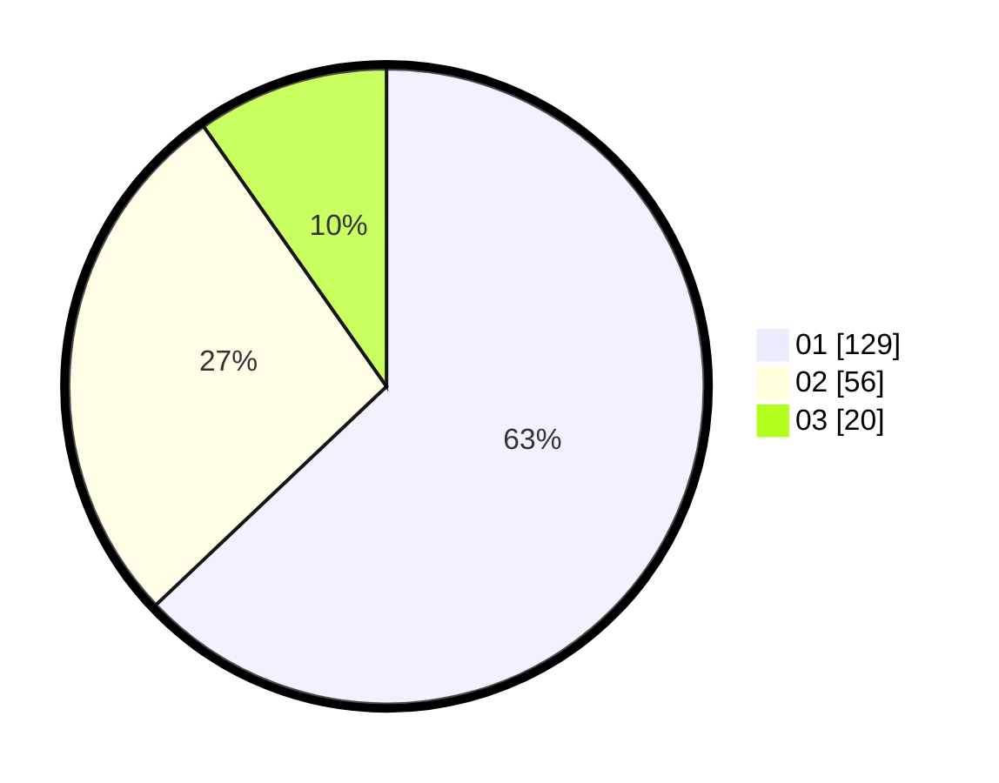

# Hasil

Hasil perolehan suara paslon dapat dilihat pada file paslon-01.txt, paslon-02.txt, dan paslon-03.txt.

Jika tidak ada, artinya data tersebut belum ada pada SIREKAP.

## Perolehan Suara

 * Paslon 01: **129**.
 * Paslon 02: **56**.
 * Paslon 03: **20**.

## Foto C Plano

https://sirekap-obj-formc.kpu.go.id/fe6a/pemilu/ppwp/31/75/04/10/07/3175041007090-20240214-213737--c7c18848-ce81-44e2-a4c2-9397fa2d448a.jpg

https://sirekap-obj-formc.kpu.go.id/fe6a/pemilu/ppwp/31/75/04/10/07/3175041007090-20240214-195616--d4d5d7a3-af25-4e22-a5e4-4421b446f89a.jpg

https://sirekap-obj-formc.kpu.go.id/fe6a/pemilu/ppwp/31/75/04/10/07/3175041007090-20240214-195744--19b02dde-f512-4e6c-8b7f-16542801ece7.jpg
