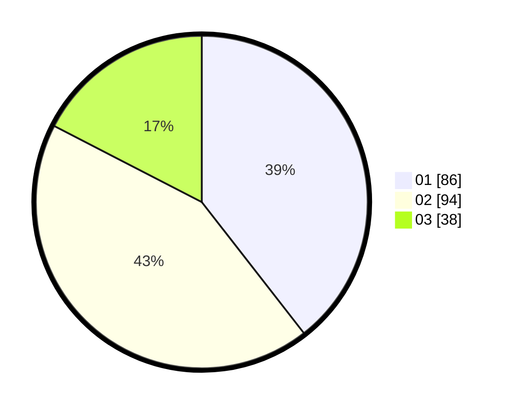

# Hasil

Hasil perolehan suara paslon dapat dilihat pada file paslon-01.txt, paslon-02.txt, dan paslon-03.txt.

Jika tidak ada, artinya data tersebut belum ada pada SIREKAP.

## Perolehan Suara

 * Paslon 01: **86**.
 * Paslon 02: **94**.
 * Paslon 03: **38**.

## Foto C Plano

https://sirekap-obj-formc.kpu.go.id/923b/pemilu/ppwp/31/75/04/10/07/3175041007092-20240214-222313--154cd83c-8677-4419-8c30-e4e0f576942f.jpg

https://sirekap-obj-formc.kpu.go.id/923b/pemilu/ppwp/31/75/04/10/07/3175041007092-20240214-222708--df039902-5f71-461b-852c-ddd1210f0e8a.jpg

https://sirekap-obj-formc.kpu.go.id/923b/pemilu/ppwp/31/75/04/10/07/3175041007092-20240214-222939--3fc51adb-eb65-47bf-83c1-1180dfac558a.jpg
