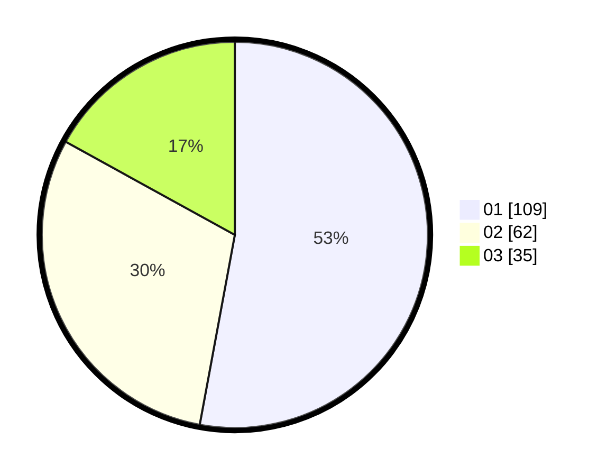

# Hasil

Hasil perolehan suara paslon dapat dilihat pada file paslon-01.txt, paslon-02.txt, dan paslon-03.txt.

Jika tidak ada, artinya data tersebut belum ada pada SIREKAP.

## Perolehan Suara

 * Paslon 01: **109**.
 * Paslon 02: **62**.
 * Paslon 03: **35**.

## Foto C Plano

https://sirekap-obj-formc.kpu.go.id/5e2f/pemilu/ppwp/31/75/04/10/07/3175041007103-20240215-035313--1ba0b765-7278-4eb6-8242-3002f92cb775.jpg

https://sirekap-obj-formc.kpu.go.id/5e2f/pemilu/ppwp/31/75/04/10/07/3175041007103-20240214-190346--f9ac0751-7024-4a19-82af-ef030a24ee9f.jpg

https://sirekap-obj-formc.kpu.go.id/5e2f/pemilu/ppwp/31/75/04/10/07/3175041007103-20240214-190456--1dcdf809-c7a2-4587-9687-77a4dab882e7.jpg
