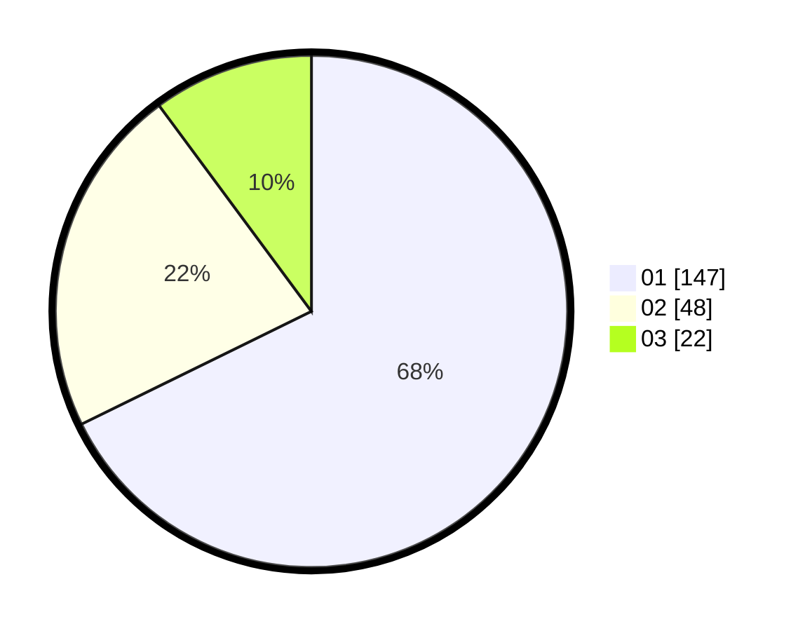

# Hasil

Hasil perolehan suara paslon dapat dilihat pada file paslon-01.txt, paslon-02.txt, dan paslon-03.txt.

Jika tidak ada, artinya data tersebut belum ada pada SIREKAP.

## Perolehan Suara

 * Paslon 01: **147**.
 * Paslon 02: **48**.
 * Paslon 03: **22**.

## Foto C Plano

https://sirekap-obj-formc.kpu.go.id/95ae/pemilu/ppwp/31/75/04/10/07/3175041007104-20240214-205640--54c0c42d-e77e-41ef-9acd-a8e82e2ea355.jpg

https://sirekap-obj-formc.kpu.go.id/95ae/pemilu/ppwp/31/75/04/10/07/3175041007104-20240214-205651--fd54c5a1-90e1-4ec1-abeb-e08b84ecd0b1.jpg

https://sirekap-obj-formc.kpu.go.id/95ae/pemilu/ppwp/31/75/04/10/07/3175041007104-20240214-205657--53cdc395-877f-48c8-8677-7f325eb6dd86.jpg
