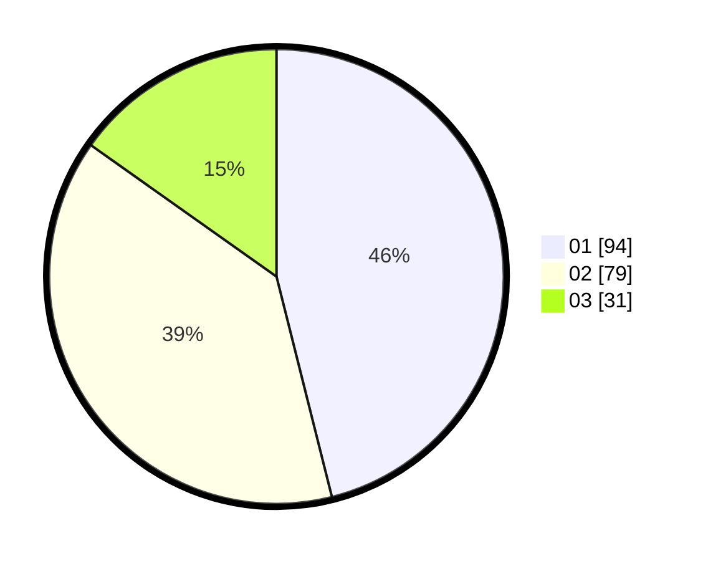

# Hasil

Hasil perolehan suara paslon dapat dilihat pada file paslon-01.txt, paslon-02.txt, dan paslon-03.txt.

Jika tidak ada, artinya data tersebut belum ada pada SIREKAP.

## Perolehan Suara

 * Paslon 01: **94**.
 * Paslon 02: **79**.
 * Paslon 03: **31**.

## Foto C Plano

https://sirekap-obj-formc.kpu.go.id/59b6/pemilu/ppwp/31/75/04/10/07/3175041007106-20240214-235304--2b228bef-4f0b-40e4-a8d3-d6cba35c06a8.jpg

https://sirekap-obj-formc.kpu.go.id/59b6/pemilu/ppwp/31/75/04/10/07/3175041007106-20240215-012614--11939bed-d0ad-49ef-9bd5-70ed81da4878.jpg

https://sirekap-obj-formc.kpu.go.id/59b6/pemilu/ppwp/31/75/04/10/07/3175041007106-20240215-012724--8213bb25-36b0-4dfe-b335-609258d4b079.jpg
