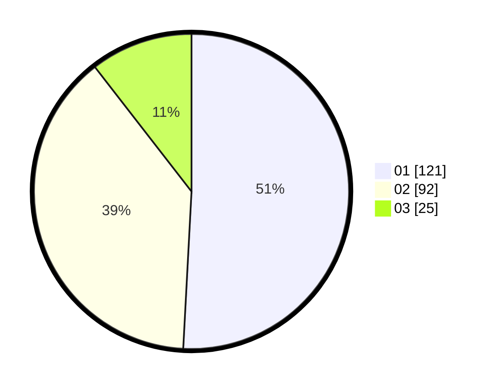

# Hasil

Hasil perolehan suara paslon dapat dilihat pada file paslon-01.txt, paslon-02.txt, dan paslon-03.txt.

Jika tidak ada, artinya data tersebut belum ada pada SIREKAP.

## Perolehan Suara

 * Paslon 01: **121**.
 * Paslon 02: **92**.
 * Paslon 03: **25**.

## Foto C Plano

https://sirekap-obj-formc.kpu.go.id/201d/pemilu/ppwp/31/75/05/10/01/3175051001008-20240218-193522--2a576358-ebab-4d61-8fb3-4a03ea86e77e.jpg

https://sirekap-obj-formc.kpu.go.id/201d/pemilu/ppwp/31/75/05/10/01/3175051001008-20240219-064053--ceca087d-2453-4ea7-90d3-df8a61ac23f6.jpg

https://sirekap-obj-formc.kpu.go.id/201d/pemilu/ppwp/31/75/05/10/01/3175051001008-20240218-205601--ac638d0a-d29a-4822-b957-230c91974aae.jpg

## DATA PEMILIH TETAP

Jumlah pemilih dalam DPT: **289**.
 * L: **143**.
 * P: **146**.

## DATA PENGGUNA HAK PILIH

Jumlah pengguna hak pilih dalam DPT: **236**.
 * L: **113**.
 * P: **123**.

Jumlah pengguna hak pilih dalam DPTb: **4**.
 * L: **0**.
 * P: **4**.

Jumlah pengguna hak pilih dalam DPK: **1**.
 * L: **1**.
 * P: **0**.

Jumlah pengguna hak pilih: **241**.
 * L: **114**.
 * P: **127**.

## JUMLAH SUARA SAH DAN TIDAK SAH

JUMLAH SELURUH SUARA SAH: **238**.

JUMLAH SUARA TIDAK SAH: **4**.

JUMLAH SELURUH SUARA SAH DAN SUARA TIDAK SAH: **242**.
