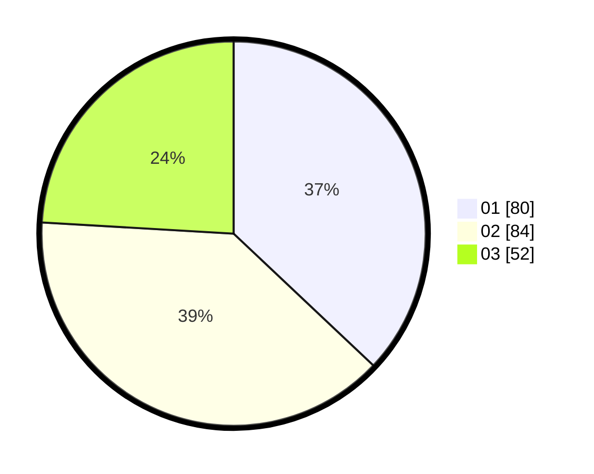

# Hasil

Hasil perolehan suara paslon dapat dilihat pada file paslon-01.txt, paslon-02.txt, dan paslon-03.txt.

Jika tidak ada, artinya data tersebut belum ada pada SIREKAP.

## Perolehan Suara

 * Paslon 01: **80**.
 * Paslon 02: **84**.
 * Paslon 03: **52**.

## Foto C Plano

https://sirekap-obj-formc.kpu.go.id/f6e9/pemilu/ppwp/31/75/05/10/01/3175051001013-20240214-224101--70fec9a3-a37f-4c9c-a441-9e36dcf7f43f.jpg

https://sirekap-obj-formc.kpu.go.id/f6e9/pemilu/ppwp/31/75/05/10/01/3175051001013-20240214-224140--350b1374-8946-4134-b2c4-7f7906348f30.jpg

https://sirekap-obj-formc.kpu.go.id/f6e9/pemilu/ppwp/31/75/05/10/01/3175051001013-20240214-224213--fc4b0896-f5ab-4431-aa1b-e56ed9107d8c.jpg
