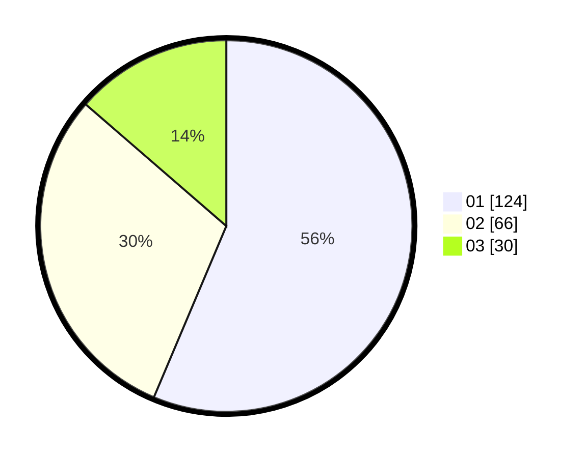

# Hasil

Hasil perolehan suara paslon dapat dilihat pada file paslon-01.txt, paslon-02.txt, dan paslon-03.txt.

Jika tidak ada, artinya data tersebut belum ada pada SIREKAP.

## Perolehan Suara

 * Paslon 01: **124**.
 * Paslon 02: **66**.
 * Paslon 03: **30**.

## Foto C Plano

https://sirekap-obj-formc.kpu.go.id/4959/pemilu/ppwp/31/75/05/10/01/3175051001020-20240214-184952--6fb6ce93-5c32-401f-9ffd-95e08777330d.jpg

https://sirekap-obj-formc.kpu.go.id/4959/pemilu/ppwp/31/75/05/10/01/3175051001020-20240214-191016--13ac0c30-4de5-43c5-81a1-60422e185da4.jpg

https://sirekap-obj-formc.kpu.go.id/4959/pemilu/ppwp/31/75/05/10/01/3175051001020-20240214-185048--2b1322db-3a90-4d71-bde0-0b8a3eac96f4.jpg

## DATA PEMILIH TETAP

Jumlah pemilih dalam DPT: **262**.
 * L: **134**.
 * P: **128**.

## DATA PENGGUNA HAK PILIH

Jumlah pengguna hak pilih dalam DPT: **207**.
 * L: **104**.
 * P: **103**.

Jumlah pengguna hak pilih dalam DPTb: **13**.
 * L: **7**.
 * P: **6**.

Jumlah pengguna hak pilih dalam DPK: **3**.
 * L: **1**.
 * P: **2**.

Jumlah pengguna hak pilih: **223**.
 * L: **112**.
 * P: **111**.

## JUMLAH SUARA SAH DAN TIDAK SAH

JUMLAH SELURUH SUARA SAH: **220**.

JUMLAH SUARA TIDAK SAH: **3**.

JUMLAH SELURUH SUARA SAH DAN SUARA TIDAK SAH: **223**.
