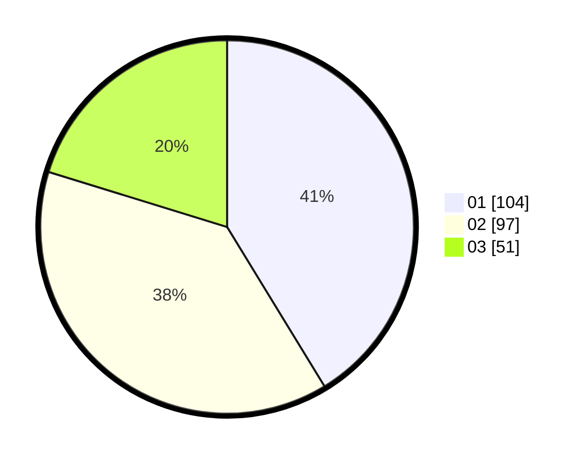

# Hasil

Hasil perolehan suara paslon dapat dilihat pada file paslon-01.txt, paslon-02.txt, dan paslon-03.txt.

Jika tidak ada, artinya data tersebut belum ada pada SIREKAP.

## Perolehan Suara

 * Paslon 01: **104**.
 * Paslon 02: **97**.
 * Paslon 03: **51**.

## Foto C Plano

https://sirekap-obj-formc.kpu.go.id/f9ec/pemilu/ppwp/31/75/05/10/01/3175051001021-20240215-002449--ad379a39-4f9a-440e-9d26-7c9ef538d515.jpg

https://sirekap-obj-formc.kpu.go.id/f9ec/pemilu/ppwp/31/75/05/10/01/3175051001021-20240216-235824--417f8ef2-fb30-4d23-bd32-19f891847cb1.jpg

https://sirekap-obj-formc.kpu.go.id/f9ec/pemilu/ppwp/31/75/05/10/01/3175051001021-20240215-002651--1a9d0e89-f107-4aff-be76-d54ad38a9882.jpg

## DATA PEMILIH TETAP

Jumlah pemilih dalam DPT: **296**.
 * L: **142**.
 * P: **154**.

## DATA PENGGUNA HAK PILIH

Jumlah pengguna hak pilih dalam DPT: **250**.
 * L: **113**.
 * P: **137**.

Jumlah pengguna hak pilih dalam DPTb: **1**.
 * L: **1**.
 * P: **0**.

Jumlah pengguna hak pilih dalam DPK: **4**.
 * L: **1**.
 * P: **3**.

Jumlah pengguna hak pilih: **255**.
 * L: **0**.
 * P: **0**.

## JUMLAH SUARA SAH DAN TIDAK SAH

JUMLAH SELURUH SUARA SAH: **252**.

JUMLAH SUARA TIDAK SAH: **3**.

JUMLAH SELURUH SUARA SAH DAN SUARA TIDAK SAH: **255**.
