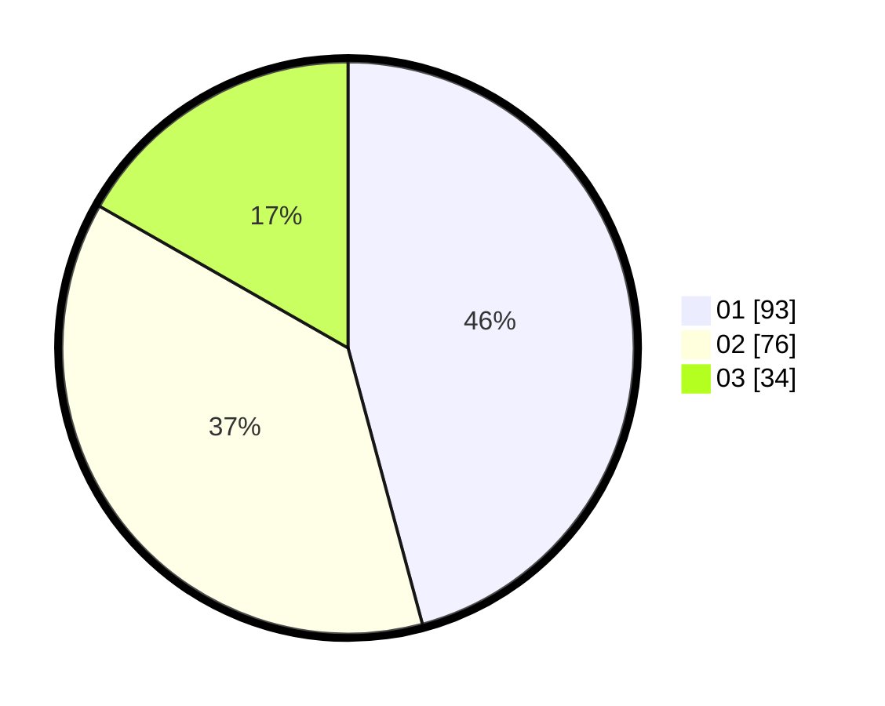

# Hasil

Hasil perolehan suara paslon dapat dilihat pada file paslon-01.txt, paslon-02.txt, dan paslon-03.txt.

Jika tidak ada, artinya data tersebut belum ada pada SIREKAP.

## Perolehan Suara

 * Paslon 01: **93**.
 * Paslon 02: **76**.
 * Paslon 03: **34**.

## Foto C Plano

https://sirekap-obj-formc.kpu.go.id/80f1/pemilu/ppwp/31/75/05/10/01/3175051001026-20240214-203444--a9529185-50de-4bc1-9f29-d817eb92a648.jpg

https://sirekap-obj-formc.kpu.go.id/80f1/pemilu/ppwp/31/75/05/10/01/3175051001026-20240214-194214--4bb6a304-17ca-428e-8ab7-0810aa65d899.jpg

https://sirekap-obj-formc.kpu.go.id/80f1/pemilu/ppwp/31/75/05/10/01/3175051001026-20240214-194435--81ec4df0-1409-49ab-a3f7-4c1dfff6cd36.jpg
