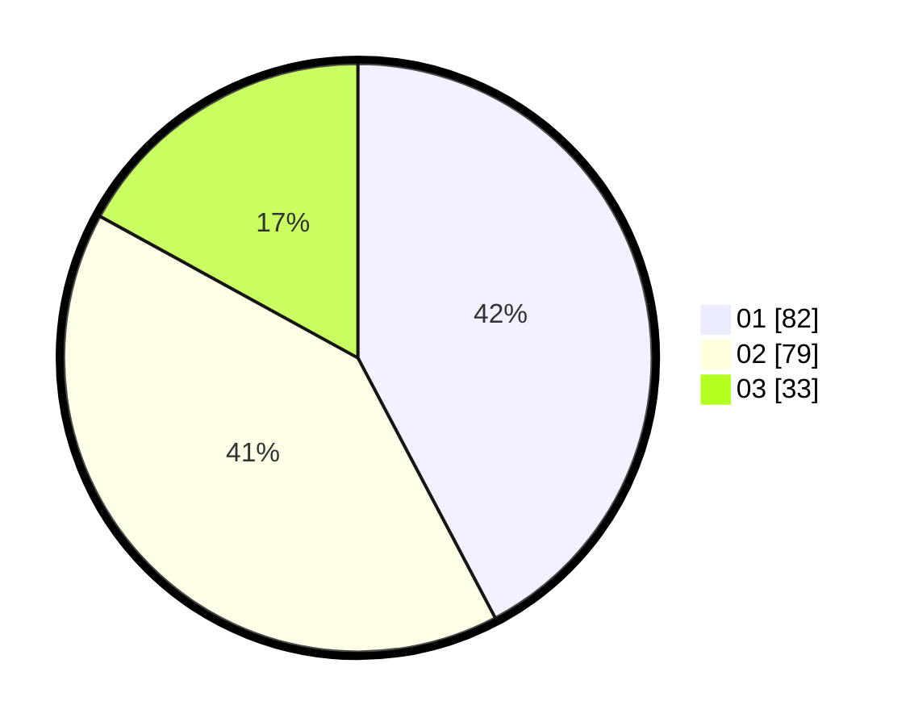

# Hasil

Hasil perolehan suara paslon dapat dilihat pada file paslon-01.txt, paslon-02.txt, dan paslon-03.txt.

Jika tidak ada, artinya data tersebut belum ada pada SIREKAP.

## Perolehan Suara

 * Paslon 01: **82**.
 * Paslon 02: **79**.
 * Paslon 03: **33**.

## Foto C Plano

https://sirekap-obj-formc.kpu.go.id/db32/pemilu/ppwp/31/75/05/10/01/3175051001029-20240214-192913--517187c0-fd0f-4b7e-b47f-3223ceb7aef0.jpg

https://sirekap-obj-formc.kpu.go.id/db32/pemilu/ppwp/31/75/05/10/01/3175051001029-20240214-192927--a8cb5ee8-ff5a-4057-ac33-651e4e71db64.jpg

https://sirekap-obj-formc.kpu.go.id/db32/pemilu/ppwp/31/75/05/10/01/3175051001029-20240214-192933--42d0fd9d-d30b-41e7-9a72-e91e7d204ce5.jpg
