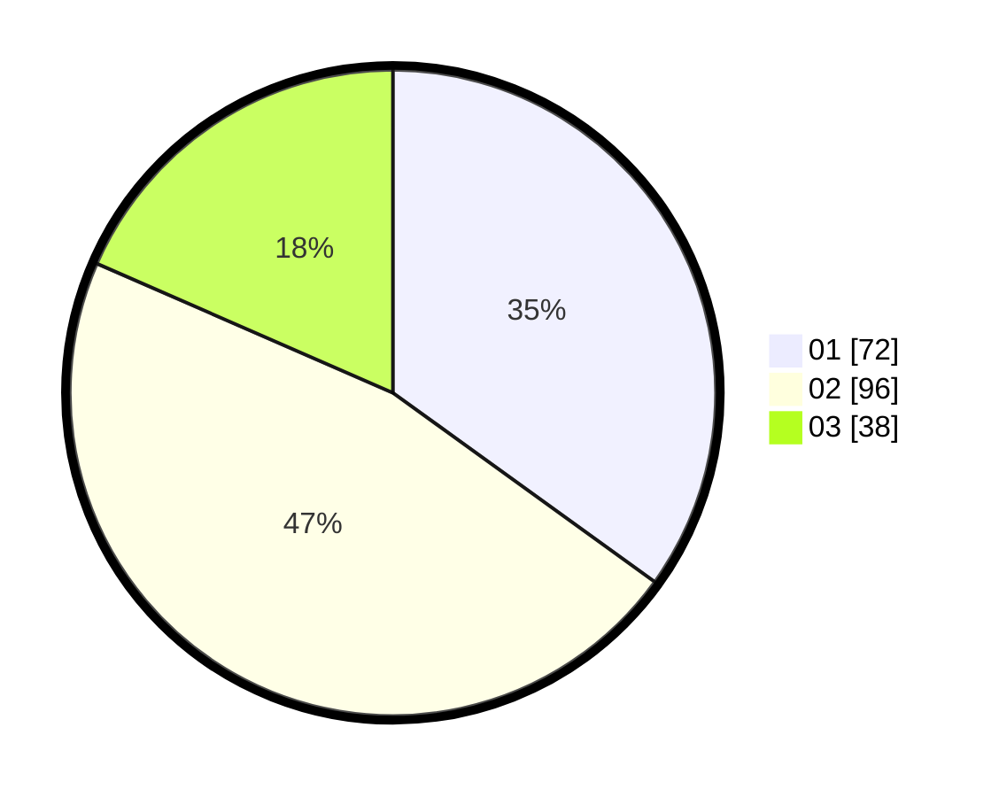

# Hasil

Hasil perolehan suara paslon dapat dilihat pada file paslon-01.txt, paslon-02.txt, dan paslon-03.txt.

Jika tidak ada, artinya data tersebut belum ada pada SIREKAP.

## Perolehan Suara

 * Paslon 01: **72**.
 * Paslon 02: **96**.
 * Paslon 03: **38**.

## Foto C Plano

https://sirekap-obj-formc.kpu.go.id/7045/pemilu/ppwp/31/75/05/10/01/3175051001030-20240214-155215--a7400c78-c1b1-45d5-abd5-5de78caee507.jpg

https://sirekap-obj-formc.kpu.go.id/7045/pemilu/ppwp/31/75/05/10/01/3175051001030-20240214-205240--eaaa186a-9884-4f23-8df9-caa9fe0b6109.jpg

https://sirekap-obj-formc.kpu.go.id/7045/pemilu/ppwp/31/75/05/10/01/3175051001030-20240214-205134--f24f46a4-d8ea-4103-8514-dcc9cdcd1837.jpg

## DATA PEMILIH TETAP

Jumlah pemilih dalam DPT: **254**.
 * L: **127**.
 * P: **127**.

## DATA PENGGUNA HAK PILIH

Jumlah pengguna hak pilih dalam DPT: **205**.
 * L: **100**.
 * P: **105**.

Jumlah pengguna hak pilih dalam DPTb: **3**.
 * L: **2**.
 * P: **1**.

Jumlah pengguna hak pilih dalam DPK: **1**.
 * L: **1**.
 * P: **0**.

Jumlah pengguna hak pilih: **209**.
 * L: **103**.
 * P: **106**.

## JUMLAH SUARA SAH DAN TIDAK SAH

JUMLAH SELURUH SUARA SAH: **206**.

JUMLAH SUARA TIDAK SAH: **3**.

JUMLAH SELURUH SUARA SAH DAN SUARA TIDAK SAH: **209**.
