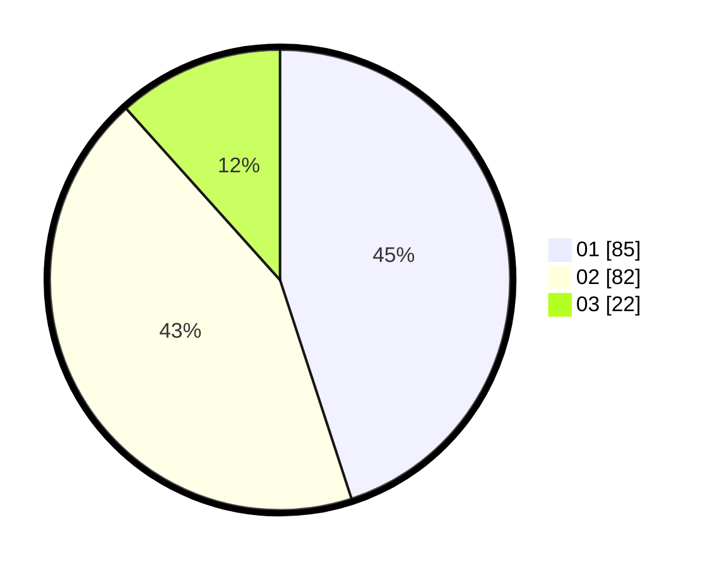

# Hasil

Hasil perolehan suara paslon dapat dilihat pada file paslon-01.txt, paslon-02.txt, dan paslon-03.txt.

Jika tidak ada, artinya data tersebut belum ada pada SIREKAP.

## Perolehan Suara

 * Paslon 01: **85**.
 * Paslon 02: **82**.
 * Paslon 03: **22**.

## Foto C Plano

https://sirekap-obj-formc.kpu.go.id/da26/pemilu/ppwp/31/75/05/10/01/3175051001031-20240214-185302--19f01d1a-e84d-4010-94b9-96ee39730ffd.jpg

https://sirekap-obj-formc.kpu.go.id/da26/pemilu/ppwp/31/75/05/10/01/3175051001031-20240214-155500--784624fb-4fa3-4d38-9541-6f8a92cb5987.jpg

https://sirekap-obj-formc.kpu.go.id/da26/pemilu/ppwp/31/75/05/10/01/3175051001031-20240214-155507--4ae6d761-fbad-47d1-af0f-a2cb4ed9a404.jpg

## DATA PEMILIH TETAP

Jumlah pemilih dalam DPT: **239**.
 * L: **122**.
 * P: **117**.

## DATA PENGGUNA HAK PILIH

Jumlah pengguna hak pilih dalam DPT: **181**.
 * L: **88**.
 * P: **93**.

Jumlah pengguna hak pilih dalam DPTb: **0**.
 * L: **0**.
 * P: **0**.

Jumlah pengguna hak pilih dalam DPK: **12**.
 * L: **5**.
 * P: **7**.

Jumlah pengguna hak pilih: **193**.
 * L: **93**.
 * P: **100**.

## JUMLAH SUARA SAH DAN TIDAK SAH

JUMLAH SELURUH SUARA SAH: **189**.

JUMLAH SUARA TIDAK SAH: **4**.

JUMLAH SELURUH SUARA SAH DAN SUARA TIDAK SAH: **193**.
