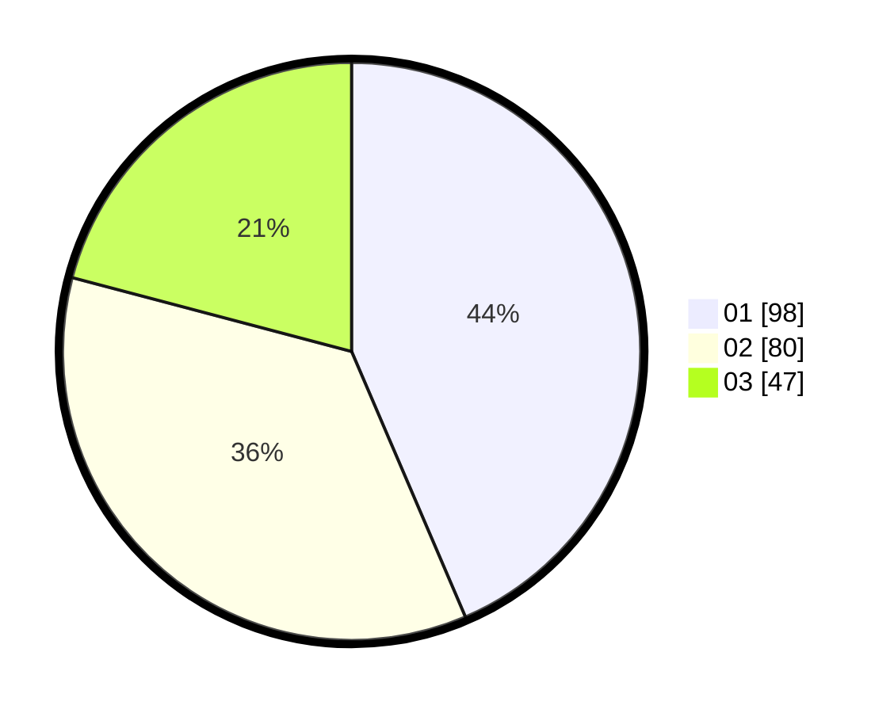

# Hasil

Hasil perolehan suara paslon dapat dilihat pada file paslon-01.txt, paslon-02.txt, dan paslon-03.txt.

Jika tidak ada, artinya data tersebut belum ada pada SIREKAP.

## Perolehan Suara

 * Paslon 01: **98**.
 * Paslon 02: **80**.
 * Paslon 03: **47**.

## Foto C Plano

https://sirekap-obj-formc.kpu.go.id/f32f/pemilu/ppwp/31/75/05/10/01/3175051001033-20240214-224932--dafd0ef2-6f12-4038-9960-9e8de8c01ff2.jpg

https://sirekap-obj-formc.kpu.go.id/f32f/pemilu/ppwp/31/75/05/10/01/3175051001033-20240214-225013--05c7176a-7805-4157-adc5-90cf365616ab.jpg

https://sirekap-obj-formc.kpu.go.id/f32f/pemilu/ppwp/31/75/05/10/01/3175051001033-20240214-225041--a3a31946-11e2-439f-a170-6ab6a194472f.jpg

## DATA PEMILIH TETAP

Jumlah pemilih dalam DPT: **269**.
 * L: **125**.
 * P: **144**.

## DATA PENGGUNA HAK PILIH

Jumlah pengguna hak pilih dalam DPT: **226**.
 * L: **97**.
 * P: **129**.

Jumlah pengguna hak pilih dalam DPTb: **2**.
 * L: **2**.
 * P: **0**.

Jumlah pengguna hak pilih dalam DPK: **0**.
 * L: **0**.
 * P: **0**.

Jumlah pengguna hak pilih: **228**.
 * L: **99**.
 * P: **129**.

## JUMLAH SUARA SAH DAN TIDAK SAH

JUMLAH SELURUH SUARA SAH: **225**.

JUMLAH SUARA TIDAK SAH: **3**.

JUMLAH SELURUH SUARA SAH DAN SUARA TIDAK SAH: **228**.
