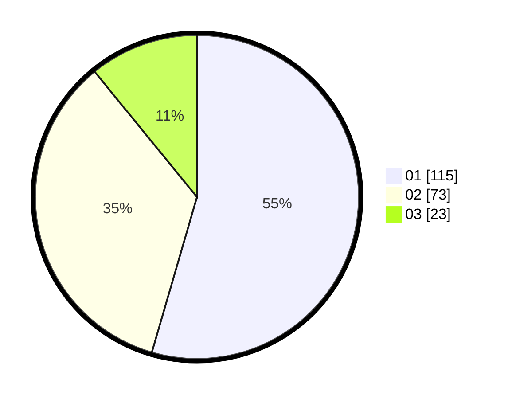

# Hasil

Hasil perolehan suara paslon dapat dilihat pada file paslon-01.txt, paslon-02.txt, dan paslon-03.txt.

Jika tidak ada, artinya data tersebut belum ada pada SIREKAP.

## Perolehan Suara

 * Paslon 01: **115**.
 * Paslon 02: **73**.
 * Paslon 03: **23**.

## Foto C Plano

https://sirekap-obj-formc.kpu.go.id/a5e2/pemilu/ppwp/31/75/05/10/01/3175051001035-20240214-083010--2c6c2113-75dd-4b71-90c2-9b001d27188c.jpg

https://sirekap-obj-formc.kpu.go.id/a5e2/pemilu/ppwp/31/75/05/10/01/3175051001035-20240215-031846--682cc709-0597-40f7-a45f-b9909fa8a4ce.jpg
