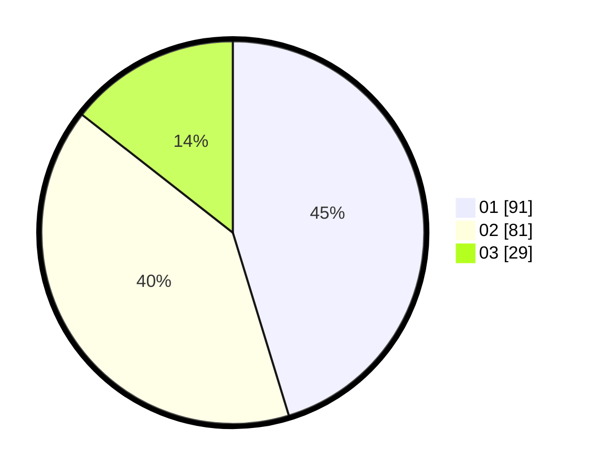

# Hasil

Hasil perolehan suara paslon dapat dilihat pada file paslon-01.txt, paslon-02.txt, dan paslon-03.txt.

Jika tidak ada, artinya data tersebut belum ada pada SIREKAP.

## Perolehan Suara

 * Paslon 01: **91**.
 * Paslon 02: **81**.
 * Paslon 03: **29**.

## Foto C Plano

https://sirekap-obj-formc.kpu.go.id/cc23/pemilu/ppwp/31/75/05/10/01/3175051001037-20240214-223951--8cb7bf68-ae5e-4cbc-b8af-d564acd59fcd.jpg

https://sirekap-obj-formc.kpu.go.id/cc23/pemilu/ppwp/31/75/05/10/01/3175051001037-20240214-223952--256606c4-1c25-4530-a2bc-604af44844f0.jpg

https://sirekap-obj-formc.kpu.go.id/cc23/pemilu/ppwp/31/75/05/10/01/3175051001037-20240214-223951--5181992a-7161-4f31-b482-d6ea6cc84589.jpg

## DATA PEMILIH TETAP

Jumlah pemilih dalam DPT: **259**.
 * L: **136**.
 * P: **123**.

## DATA PENGGUNA HAK PILIH

Jumlah pengguna hak pilih dalam DPT: **202**.
 * L: **100**.
 * P: **102**.

Jumlah pengguna hak pilih dalam DPTb: **2**.
 * L: **1**.
 * P: **1**.

Jumlah pengguna hak pilih dalam DPK: **1**.
 * L: **0**.
 * P: **1**.

Jumlah pengguna hak pilih: **205**.
 * L: **101**.
 * P: **104**.

## JUMLAH SUARA SAH DAN TIDAK SAH

JUMLAH SELURUH SUARA SAH: **201**.

JUMLAH SUARA TIDAK SAH: **4**.

JUMLAH SELURUH SUARA SAH DAN SUARA TIDAK SAH: **205**.
