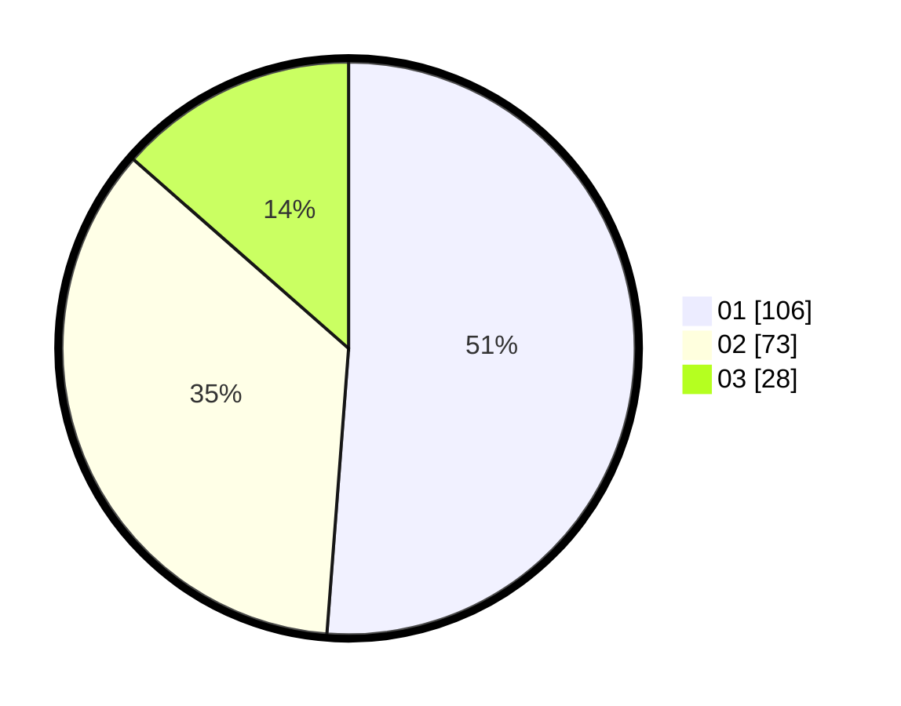

# Hasil

Hasil perolehan suara paslon dapat dilihat pada file paslon-01.txt, paslon-02.txt, dan paslon-03.txt.

Jika tidak ada, artinya data tersebut belum ada pada SIREKAP.

## Perolehan Suara

 * Paslon 01: **106**.
 * Paslon 02: **73**.
 * Paslon 03: **28**.

## Foto C Plano

https://sirekap-obj-formc.kpu.go.id/f621/pemilu/ppwp/31/75/05/10/01/3175051001040-20240214-192848--d5b731f5-b4fd-414e-86ad-6a07e54a62d7.jpg

https://sirekap-obj-formc.kpu.go.id/f621/pemilu/ppwp/31/75/05/10/01/3175051001040-20240214-192853--1c8025b1-b659-407d-b27c-d0574527add5.jpg

https://sirekap-obj-formc.kpu.go.id/f621/pemilu/ppwp/31/75/05/10/01/3175051001040-20240214-192857--2d70d2ba-b80d-498b-a13d-982afd58a4a5.jpg

## DATA PEMILIH TETAP

Jumlah pemilih dalam DPT: **213**.
 * L: **100**.
 * P: **113**.

## DATA PENGGUNA HAK PILIH

Jumlah pengguna hak pilih dalam DPT: **268**.
 * L: **130**.
 * P: **138**.

Jumlah pengguna hak pilih dalam DPTb: **0**.
 * L: **0**.
 * P: **0**.

Jumlah pengguna hak pilih dalam DPK: **0**.
 * L: **0**.
 * P: **0**.

Jumlah pengguna hak pilih: **268**.
 * L: **130**.
 * P: **138**.

## JUMLAH SUARA SAH DAN TIDAK SAH

JUMLAH SELURUH SUARA SAH: **207**.

JUMLAH SUARA TIDAK SAH: **6**.

JUMLAH SELURUH SUARA SAH DAN SUARA TIDAK SAH: **213**.
