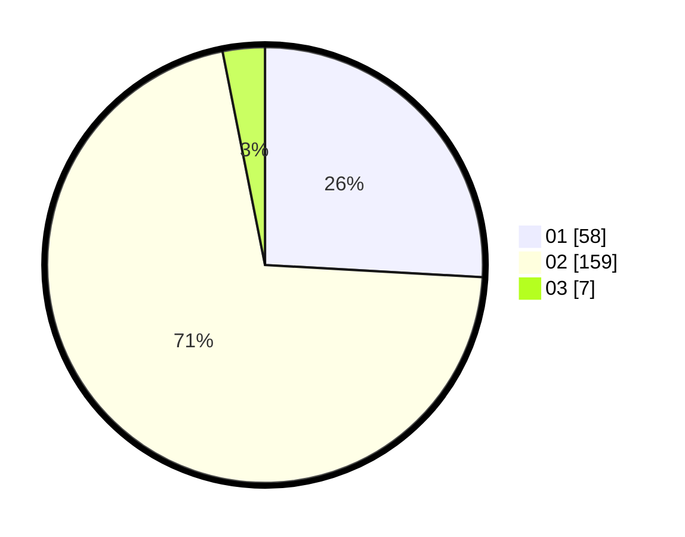

# Hasil

Hasil perolehan suara paslon dapat dilihat pada file paslon-01.txt, paslon-02.txt, dan paslon-03.txt.

Jika tidak ada, artinya data tersebut belum ada pada SIREKAP.

## Perolehan Suara

 * Paslon 01: **58**.
 * Paslon 02: **159**.
 * Paslon 03: **7**.

## Foto C Plano

https://sirekap-obj-formc.kpu.go.id/a039/pemilu/ppwp/31/75/05/10/01/3175051001049-20240214-201417--d69908a7-98fc-4ec8-b248-1fc2b3c39fb8.jpg

https://sirekap-obj-formc.kpu.go.id/a039/pemilu/ppwp/31/75/05/10/01/3175051001049-20240214-201456--6884ca9b-b75b-40ae-b850-e2d7e185997d.jpg

https://sirekap-obj-formc.kpu.go.id/a039/pemilu/ppwp/31/75/05/10/01/3175051001049-20240214-201520--e60da811-397c-438d-a07a-2ab210022b34.jpg
