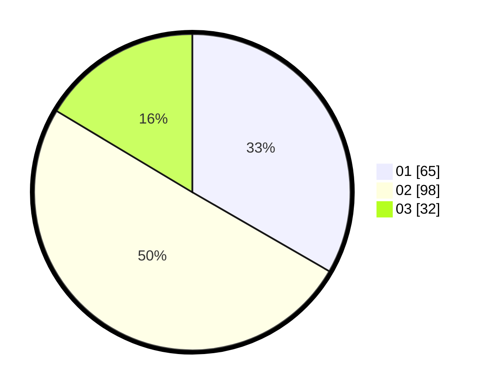

# Hasil

Hasil perolehan suara paslon dapat dilihat pada file paslon-01.txt, paslon-02.txt, dan paslon-03.txt.

Jika tidak ada, artinya data tersebut belum ada pada SIREKAP.

## Perolehan Suara

 * Paslon 01: **65**.
 * Paslon 02: **98**.
 * Paslon 03: **32**.

## Foto C Plano

https://sirekap-obj-formc.kpu.go.id/f651/pemilu/ppwp/31/75/05/10/01/3175051001056-20240214-184611--85ec6814-a757-4d34-b6ca-c51bab47c6de.jpg

https://sirekap-obj-formc.kpu.go.id/f651/pemilu/ppwp/31/75/05/10/01/3175051001056-20240214-184621--453db2b2-02e3-4558-ae2d-4e979a55c8b7.jpg

https://sirekap-obj-formc.kpu.go.id/f651/pemilu/ppwp/31/75/05/10/01/3175051001056-20240214-184626--0099b2ee-1de9-4bbd-8577-8939fbe55ff6.jpg

## DATA PEMILIH TETAP

Jumlah pemilih dalam DPT: **257**.
 * L: **129**.
 * P: **128**.

## DATA PENGGUNA HAK PILIH

Jumlah pengguna hak pilih dalam DPT: **189**.
 * L: **92**.
 * P: **97**.

Jumlah pengguna hak pilih dalam DPTb: **6**.
 * L: **3**.
 * P: **3**.

Jumlah pengguna hak pilih dalam DPK: **0**.
 * L: **0**.
 * P: **0**.

Jumlah pengguna hak pilih: **195**.
 * L: **95**.
 * P: **100**.

## JUMLAH SUARA SAH DAN TIDAK SAH

JUMLAH SELURUH SUARA SAH: **195**.

JUMLAH SUARA TIDAK SAH: **0**.

JUMLAH SELURUH SUARA SAH DAN SUARA TIDAK SAH: **195**.
