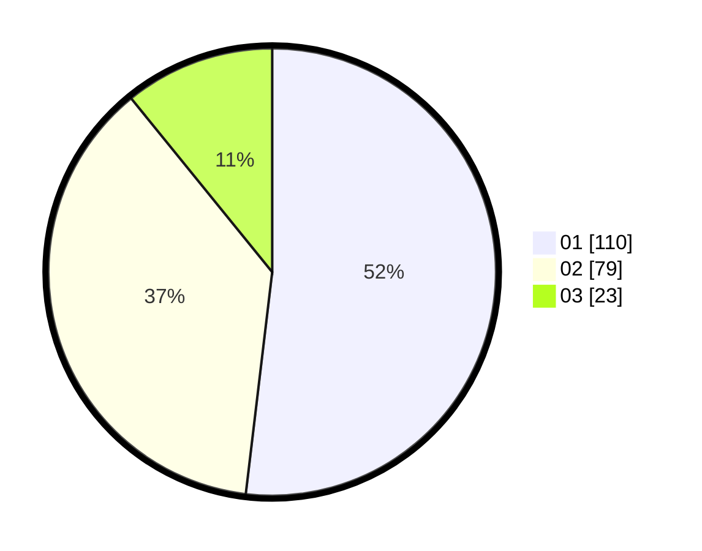

# Hasil

Hasil perolehan suara paslon dapat dilihat pada file paslon-01.txt, paslon-02.txt, dan paslon-03.txt.

Jika tidak ada, artinya data tersebut belum ada pada SIREKAP.

## Perolehan Suara

 * Paslon 01: **110**.
 * Paslon 02: **79**.
 * Paslon 03: **23**.

## Foto C Plano

https://sirekap-obj-formc.kpu.go.id/7d02/pemilu/ppwp/31/75/05/10/01/3175051001057-20240214-155217--fe8a5fa1-e8d6-4bf3-9d08-dcc86c49f02c.jpg

https://sirekap-obj-formc.kpu.go.id/7d02/pemilu/ppwp/31/75/05/10/01/3175051001057-20240214-155113--47853fb7-431b-48cf-8087-d8bae05a52bf.jpg
