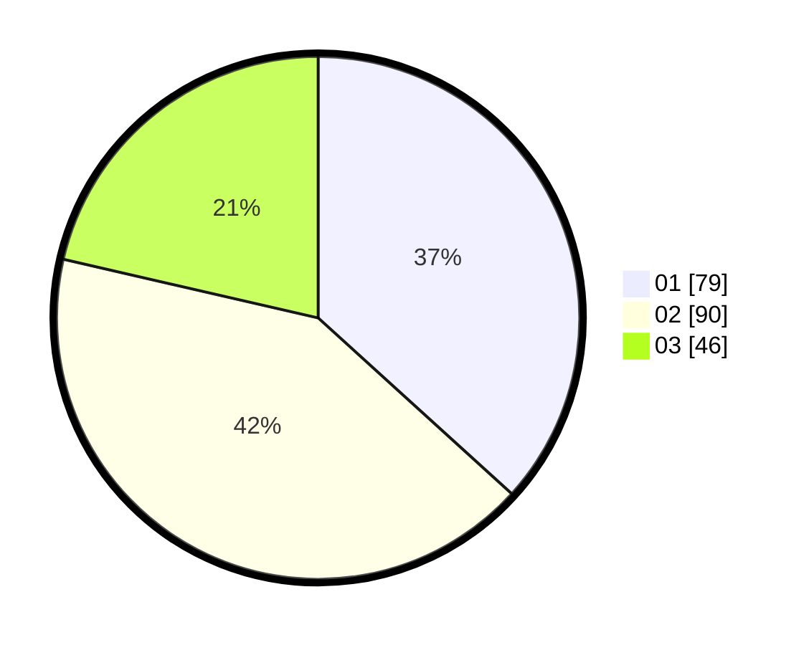

# Hasil

Hasil perolehan suara paslon dapat dilihat pada file paslon-01.txt, paslon-02.txt, dan paslon-03.txt.

Jika tidak ada, artinya data tersebut belum ada pada SIREKAP.

## Perolehan Suara

 * Paslon 01: **79**.
 * Paslon 02: **90**.
 * Paslon 03: **46**.

## Foto C Plano

https://sirekap-obj-formc.kpu.go.id/e259/pemilu/ppwp/31/75/05/10/01/3175051001063-20240214-195643--35d5260d-ccb0-4e0d-88fe-9d39254ba730.jpg

https://sirekap-obj-formc.kpu.go.id/e259/pemilu/ppwp/31/75/05/10/01/3175051001063-20240214-195333--bd603c84-1241-4387-9a00-a917957f7184.jpg

https://sirekap-obj-formc.kpu.go.id/e259/pemilu/ppwp/31/75/05/10/01/3175051001063-20240214-195521--b003061b-2ff0-4937-a318-4a4f04723e6d.jpg
