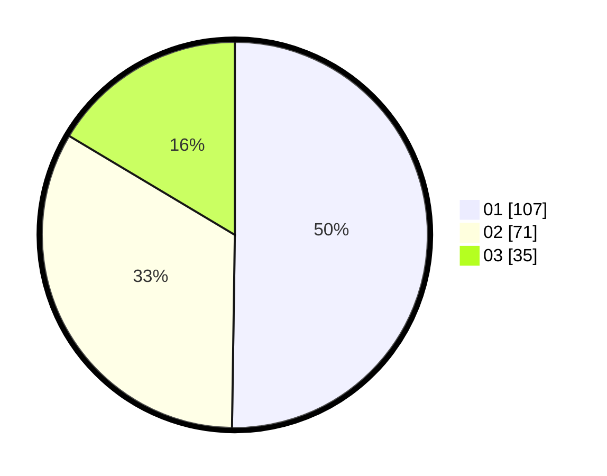

# Hasil

Hasil perolehan suara paslon dapat dilihat pada file paslon-01.txt, paslon-02.txt, dan paslon-03.txt.

Jika tidak ada, artinya data tersebut belum ada pada SIREKAP.

## Perolehan Suara

 * Paslon 01: **107**.
 * Paslon 02: **71**.
 * Paslon 03: **35**.

## Foto C Plano

https://sirekap-obj-formc.kpu.go.id/902f/pemilu/ppwp/31/75/05/10/01/3175051001067-20240214-210630--5d744a80-5d8e-4250-9c8d-c88fb17571c2.jpg

https://sirekap-obj-formc.kpu.go.id/902f/pemilu/ppwp/31/75/05/10/01/3175051001067-20240214-210728--cd76dc70-0c52-4f2b-8b46-21ad4617d760.jpg

https://sirekap-obj-formc.kpu.go.id/902f/pemilu/ppwp/31/75/05/10/01/3175051001067-20240214-205946--2040cf75-72d5-4ab6-a58c-199bae885395.jpg
