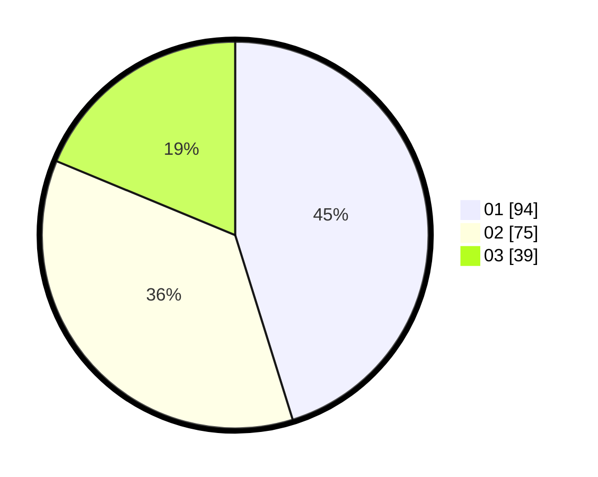

# Hasil

Hasil perolehan suara paslon dapat dilihat pada file paslon-01.txt, paslon-02.txt, dan paslon-03.txt.

Jika tidak ada, artinya data tersebut belum ada pada SIREKAP.

## Perolehan Suara

 * Paslon 01: **94**.
 * Paslon 02: **75**.
 * Paslon 03: **39**.

## Foto C Plano

https://sirekap-obj-formc.kpu.go.id/1c3e/pemilu/ppwp/31/75/05/10/01/3175051001068-20240215-012533--4942ea1f-e06c-47a2-ab33-1bd2c2345f93.jpg

https://sirekap-obj-formc.kpu.go.id/1c3e/pemilu/ppwp/31/75/05/10/01/3175051001068-20240215-012640--42f9dfb6-7dda-4ab7-ab39-1f79b6cb53e1.jpg
