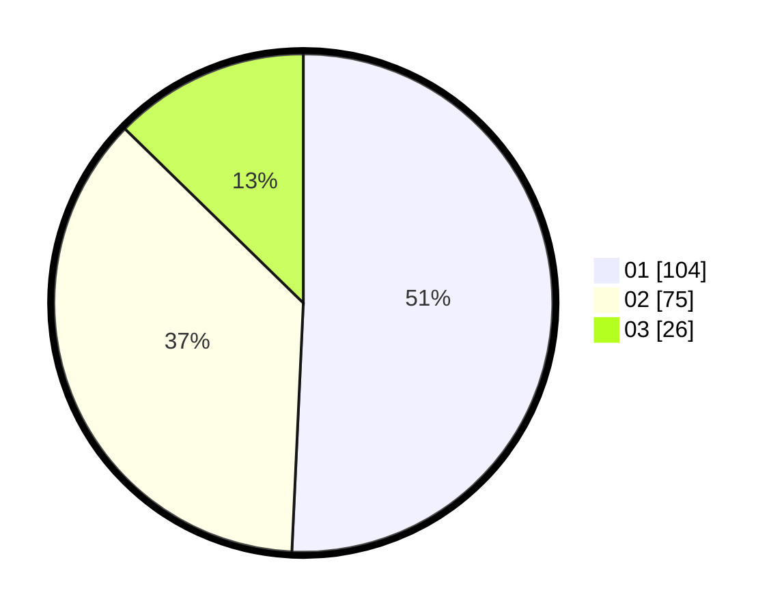

# Hasil

Hasil perolehan suara paslon dapat dilihat pada file paslon-01.txt, paslon-02.txt, dan paslon-03.txt.

Jika tidak ada, artinya data tersebut belum ada pada SIREKAP.

## Perolehan Suara

 * Paslon 01: **104**.
 * Paslon 02: **75**.
 * Paslon 03: **26**.

## Foto C Plano

https://sirekap-obj-formc.kpu.go.id/e1a5/pemilu/ppwp/31/75/05/10/01/3175051001070-20240215-011953--6e68cf2f-ad95-4dd0-b1ce-85279f5b2325.jpg

https://sirekap-obj-formc.kpu.go.id/e1a5/pemilu/ppwp/31/75/05/10/01/3175051001070-20240215-012054--699e98a8-040e-423c-90f1-4bf254a08fe9.jpg

https://sirekap-obj-formc.kpu.go.id/e1a5/pemilu/ppwp/31/75/05/10/01/3175051001070-20240215-012150--fec71d5d-a236-4250-ad67-75e70bdd5f28.jpg

## DATA PEMILIH TETAP

Jumlah pemilih dalam DPT: **261**.
 * L: **125**.
 * P: **136**.

## DATA PENGGUNA HAK PILIH

Jumlah pengguna hak pilih dalam DPT: **201**.
 * L: **91**.
 * P: **110**.

Jumlah pengguna hak pilih dalam DPTb: **8**.
 * L: **4**.
 * P: **4**.

Jumlah pengguna hak pilih dalam DPK: **0**.
 * L: **0**.
 * P: **0**.

Jumlah pengguna hak pilih: **209**.
 * L: **95**.
 * P: **114**.

## JUMLAH SUARA SAH DAN TIDAK SAH

JUMLAH SELURUH SUARA SAH: **205**.

JUMLAH SUARA TIDAK SAH: **4**.

JUMLAH SELURUH SUARA SAH DAN SUARA TIDAK SAH: **209**.
