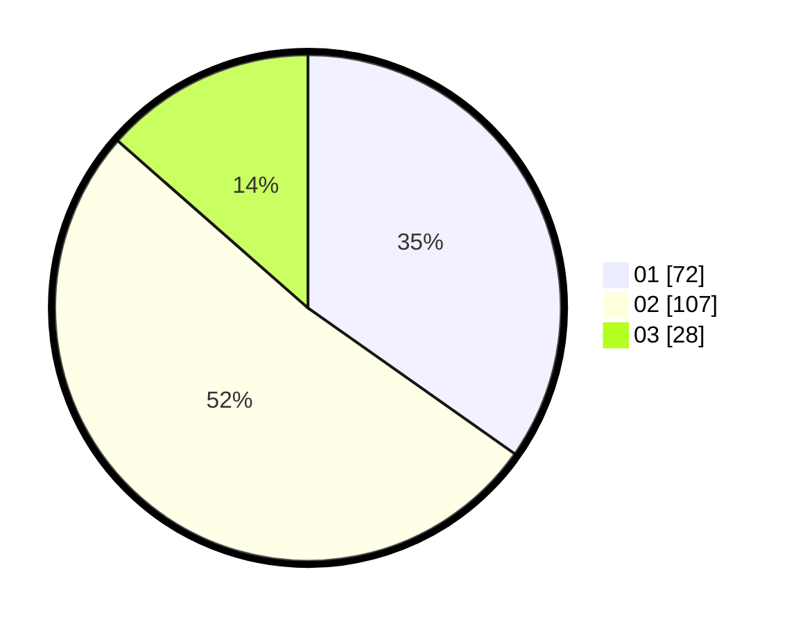

# Hasil

Hasil perolehan suara paslon dapat dilihat pada file paslon-01.txt, paslon-02.txt, dan paslon-03.txt.

Jika tidak ada, artinya data tersebut belum ada pada SIREKAP.

## Perolehan Suara

 * Paslon 01: **72**.
 * Paslon 02: **107**.
 * Paslon 03: **28**.

## Foto C Plano

https://sirekap-obj-formc.kpu.go.id/55e6/pemilu/ppwp/31/75/05/10/01/3175051001076-20240214-192505--8e052995-8837-4cbc-a562-5f2d7523912c.jpg

https://sirekap-obj-formc.kpu.go.id/55e6/pemilu/ppwp/31/75/05/10/01/3175051001076-20240214-210315--c7e69209-9311-496e-bc68-275b3dd0a05c.jpg

https://sirekap-obj-formc.kpu.go.id/55e6/pemilu/ppwp/31/75/05/10/01/3175051001076-20240214-194022--af985642-9402-4eff-aa10-d827fcdb8d4d.jpg

## DATA PEMILIH TETAP

Jumlah pemilih dalam DPT: **257**.
 * L: **120**.
 * P: **137**.

## DATA PENGGUNA HAK PILIH

Jumlah pengguna hak pilih dalam DPT: **208**.
 * L: **97**.
 * P: **111**.

Jumlah pengguna hak pilih dalam DPTb: **1**.
 * L: **1**.
 * P: **0**.

Jumlah pengguna hak pilih dalam DPK: **0**.
 * L: **0**.
 * P: **0**.

Jumlah pengguna hak pilih: **209**.
 * L: **98**.
 * P: **111**.

## JUMLAH SUARA SAH DAN TIDAK SAH

JUMLAH SELURUH SUARA SAH: **207**.

JUMLAH SUARA TIDAK SAH: **2**.

JUMLAH SELURUH SUARA SAH DAN SUARA TIDAK SAH: **209**.
