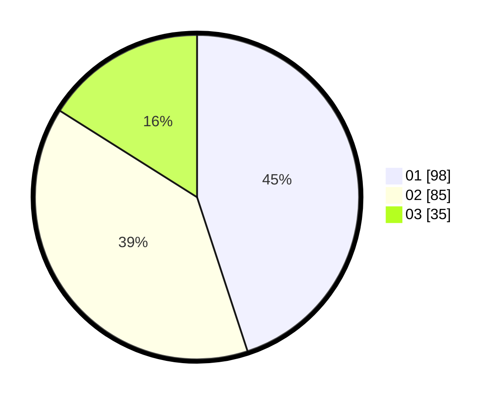

# Hasil

Hasil perolehan suara paslon dapat dilihat pada file paslon-01.txt, paslon-02.txt, dan paslon-03.txt.

Jika tidak ada, artinya data tersebut belum ada pada SIREKAP.

## Perolehan Suara

 * Paslon 01: **98**.
 * Paslon 02: **85**.
 * Paslon 03: **35**.

## Foto C Plano

https://sirekap-obj-formc.kpu.go.id/8540/pemilu/ppwp/31/75/05/10/01/3175051001077-20240214-224956--736fee8a-2a92-4c4b-99b2-49472b0957de.jpg

https://sirekap-obj-formc.kpu.go.id/8540/pemilu/ppwp/31/75/05/10/01/3175051001077-20240214-224959--055cf206-ee1f-4f96-a27b-93d40b56d83f.jpg

https://sirekap-obj-formc.kpu.go.id/8540/pemilu/ppwp/31/75/05/10/01/3175051001077-20240214-225004--79c296c8-6bb8-4e02-b621-89ce2c153518.jpg
