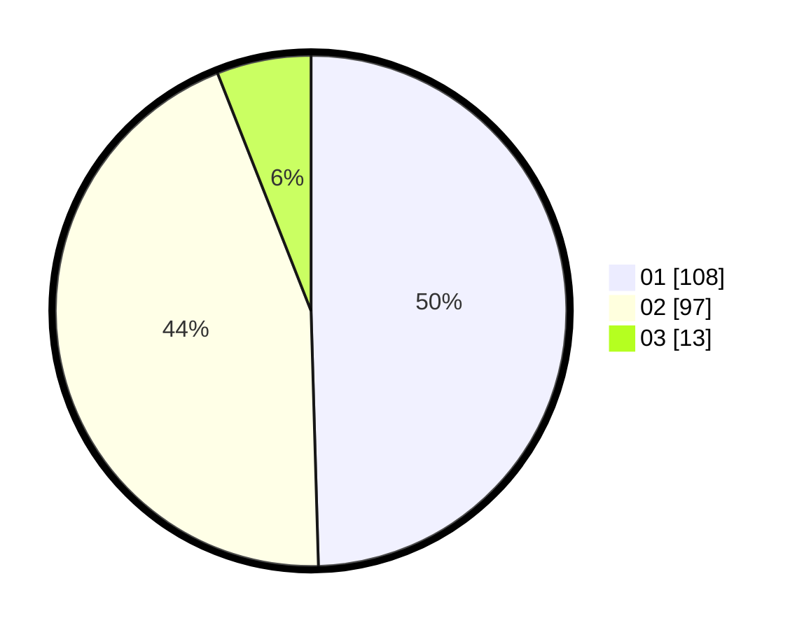

# Hasil

Hasil perolehan suara paslon dapat dilihat pada file paslon-01.txt, paslon-02.txt, dan paslon-03.txt.

Jika tidak ada, artinya data tersebut belum ada pada SIREKAP.

## Perolehan Suara

 * Paslon 01: **108**.
 * Paslon 02: **97**.
 * Paslon 03: **13**.

## Foto C Plano

https://sirekap-obj-formc.kpu.go.id/9684/pemilu/ppwp/31/75/05/10/01/3175051001081-20240214-155004--c7cd0357-cd94-4d8d-bdb4-d7b43c7e2f88.jpg

https://sirekap-obj-formc.kpu.go.id/9684/pemilu/ppwp/31/75/05/10/01/3175051001081-20240214-155006--17e68ef4-9aa0-471b-a2d2-ca8372bcf563.jpg

https://sirekap-obj-formc.kpu.go.id/9684/pemilu/ppwp/31/75/05/10/01/3175051001081-20240214-155009--6cab4711-1ff6-47c3-a864-89d2bc5e58c2.jpg

## DATA PEMILIH TETAP

Jumlah pemilih dalam DPT: **253**.
 * L: **119**.
 * P: **134**.

## DATA PENGGUNA HAK PILIH

Jumlah pengguna hak pilih dalam DPT: **221**.
 * L: **106**.
 * P: **115**.

Jumlah pengguna hak pilih dalam DPTb: **2**.
 * L: **0**.
 * P: **2**.

Jumlah pengguna hak pilih dalam DPK: **0**.
 * L: **0**.
 * P: **0**.

Jumlah pengguna hak pilih: **223**.
 * L: **106**.
 * P: **117**.

## JUMLAH SUARA SAH DAN TIDAK SAH

JUMLAH SELURUH SUARA SAH: **218**.

JUMLAH SUARA TIDAK SAH: **5**.

JUMLAH SELURUH SUARA SAH DAN SUARA TIDAK SAH: **223**.
