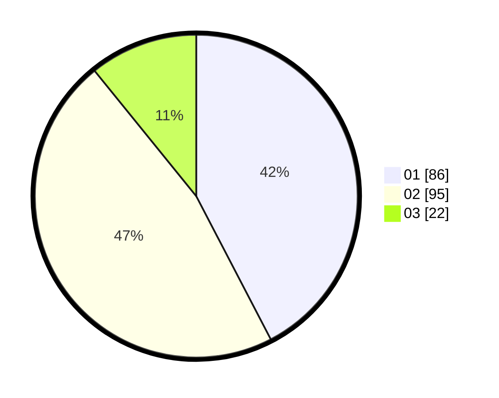

# Hasil

Hasil perolehan suara paslon dapat dilihat pada file paslon-01.txt, paslon-02.txt, dan paslon-03.txt.

Jika tidak ada, artinya data tersebut belum ada pada SIREKAP.

## Perolehan Suara

 * Paslon 01: **86**.
 * Paslon 02: **95**.
 * Paslon 03: **22**.

## Foto C Plano

https://sirekap-obj-formc.kpu.go.id/e2f3/pemilu/ppwp/31/75/05/10/01/3175051001082-20240214-215848--4a4110dc-0a26-4d9d-8f7e-181eedc85423.jpg

https://sirekap-obj-formc.kpu.go.id/e2f3/pemilu/ppwp/31/75/05/10/01/3175051001082-20240214-211329--66526301-f216-4553-9e2f-67a31a6b15d0.jpg

https://sirekap-obj-formc.kpu.go.id/e2f3/pemilu/ppwp/31/75/05/10/01/3175051001082-20240214-215857--e81818e8-e816-4771-a56c-47f7352ffba7.jpg

## DATA PEMILIH TETAP

Jumlah pemilih dalam DPT: **202**.
 * L: **94**.
 * P: **108**.

## DATA PENGGUNA HAK PILIH

Jumlah pengguna hak pilih dalam DPT: **261**.
 * L: **128**.
 * P: **133**.

Jumlah pengguna hak pilih dalam DPTb: **3**.
 * L: **1**.
 * P: **2**.

Jumlah pengguna hak pilih dalam DPK: **0**.
 * L: **0**.
 * P: **0**.

Jumlah pengguna hak pilih: **264**.
 * L: **129**.
 * P: **135**.

## JUMLAH SUARA SAH DAN TIDAK SAH

JUMLAH SELURUH SUARA SAH: **203**.

JUMLAH SUARA TIDAK SAH: **2**.

JUMLAH SELURUH SUARA SAH DAN SUARA TIDAK SAH: **205**.
