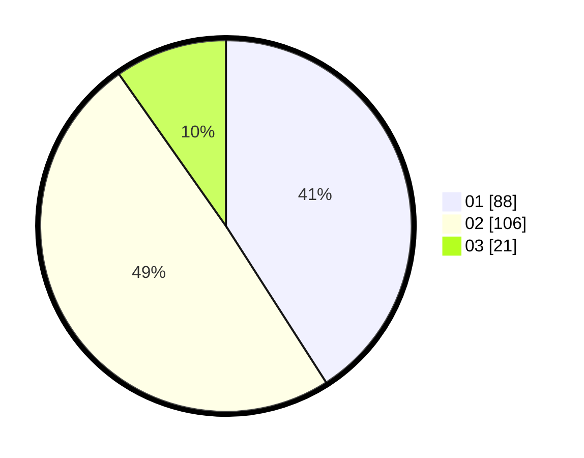

# Hasil

Hasil perolehan suara paslon dapat dilihat pada file paslon-01.txt, paslon-02.txt, dan paslon-03.txt.

Jika tidak ada, artinya data tersebut belum ada pada SIREKAP.

## Perolehan Suara

 * Paslon 01: **88**.
 * Paslon 02: **106**.
 * Paslon 03: **21**.

## Foto C Plano

https://sirekap-obj-formc.kpu.go.id/d289/pemilu/ppwp/31/75/05/10/01/3175051001085-20240215-045601--153841fa-ddf4-40cc-ac99-070afbc9b939.jpg

https://sirekap-obj-formc.kpu.go.id/d289/pemilu/ppwp/31/75/05/10/01/3175051001085-20240215-045717--5d620dd7-dd73-42e5-84a6-98b3e2abf1d5.jpg

https://sirekap-obj-formc.kpu.go.id/d289/pemilu/ppwp/31/75/05/10/01/3175051001085-20240214-231611--75ce5366-eeea-4a34-b375-060fd641b58c.jpg
