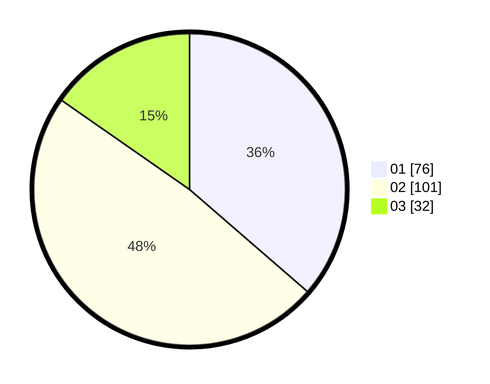

# Hasil

Hasil perolehan suara paslon dapat dilihat pada file paslon-01.txt, paslon-02.txt, dan paslon-03.txt.

Jika tidak ada, artinya data tersebut belum ada pada SIREKAP.

## Perolehan Suara

 * Paslon 01: **76**.
 * Paslon 02: **101**.
 * Paslon 03: **32**.

## Foto C Plano

https://sirekap-obj-formc.kpu.go.id/a7b3/pemilu/ppwp/31/75/05/10/01/3175051001087-20240214-202340--a449f659-e6fb-46c3-822a-5e3314eb6aba.jpg

https://sirekap-obj-formc.kpu.go.id/a7b3/pemilu/ppwp/31/75/05/10/01/3175051001087-20240214-202431--8dab650f-d4b4-4145-9cfb-1242118709d0.jpg

https://sirekap-obj-formc.kpu.go.id/a7b3/pemilu/ppwp/31/75/05/10/01/3175051001087-20240214-203024--f5df202f-04c3-458b-9e54-5b9b0270a340.jpg
