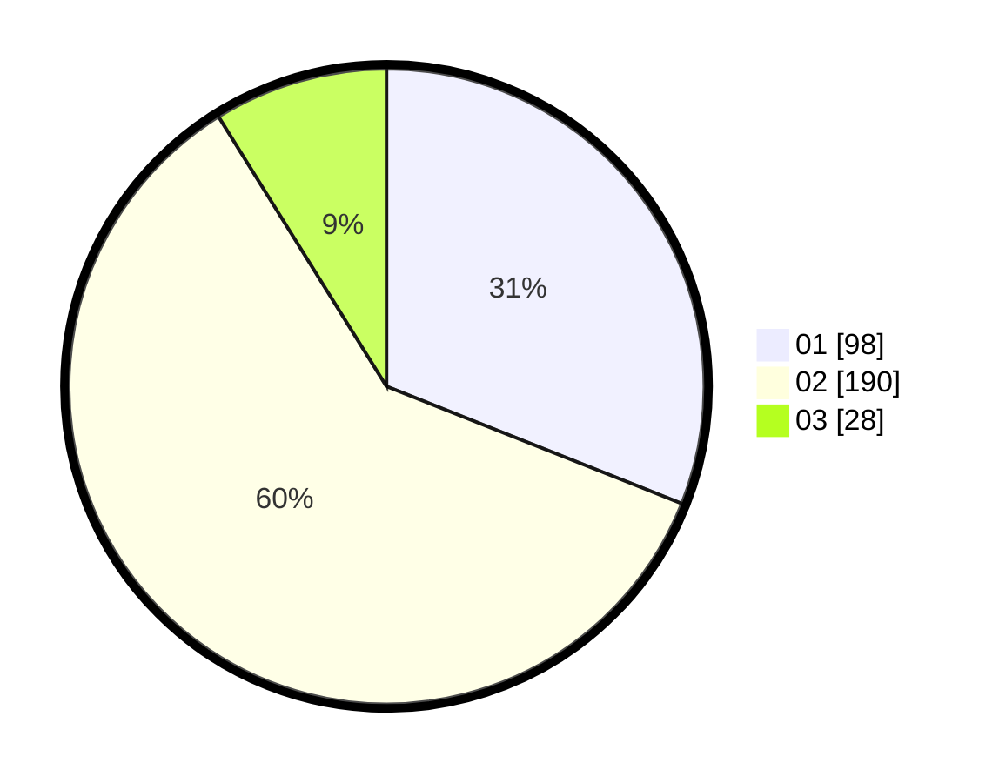

# Hasil

Hasil perolehan suara paslon dapat dilihat pada file paslon-01.txt, paslon-02.txt, dan paslon-03.txt.

Jika tidak ada, artinya data tersebut belum ada pada SIREKAP.

## Perolehan Suara

 * Paslon 01: **98**.
 * Paslon 02: **190**.
 * Paslon 03: **28**.

## Foto C Plano

https://sirekap-obj-formc.kpu.go.id/f9ef/pemilu/ppwp/31/75/05/10/01/3175051001088-20240215-115524--75e90c3f-5d64-4bb7-8010-b41f257c870f.jpg

https://sirekap-obj-formc.kpu.go.id/f9ef/pemilu/ppwp/31/75/05/10/01/3175051001088-20240215-115742--18e82200-8519-4464-bf72-a26c544c0034.jpg

https://sirekap-obj-formc.kpu.go.id/f9ef/pemilu/ppwp/31/75/05/10/01/3175051001088-20240215-120006--e64676d1-5350-4789-97d9-5a4997648818.jpg
