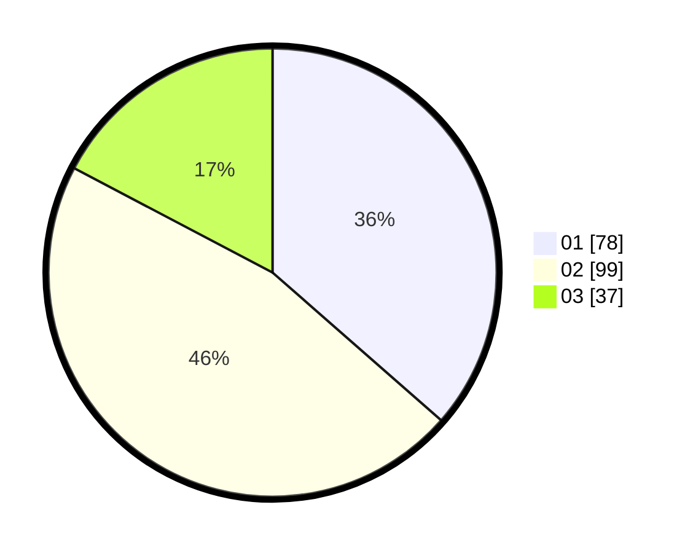

# Hasil

Hasil perolehan suara paslon dapat dilihat pada file paslon-01.txt, paslon-02.txt, dan paslon-03.txt.

Jika tidak ada, artinya data tersebut belum ada pada SIREKAP.

## Perolehan Suara

 * Paslon 01: **78**.
 * Paslon 02: **99**.
 * Paslon 03: **37**.

## Foto C Plano

https://sirekap-obj-formc.kpu.go.id/9004/pemilu/ppwp/31/75/05/10/01/3175051001089-20240214-224504--c02d1c39-5369-4c99-87e8-550eb66e2102.jpg

https://sirekap-obj-formc.kpu.go.id/9004/pemilu/ppwp/31/75/05/10/01/3175051001089-20240214-224650--65aedaee-4323-45a6-841e-239cdf2c21b3.jpg

https://sirekap-obj-formc.kpu.go.id/9004/pemilu/ppwp/31/75/05/10/01/3175051001089-20240214-224750--ef6d28c0-fd14-408e-bb6e-52e28838c0cc.jpg
