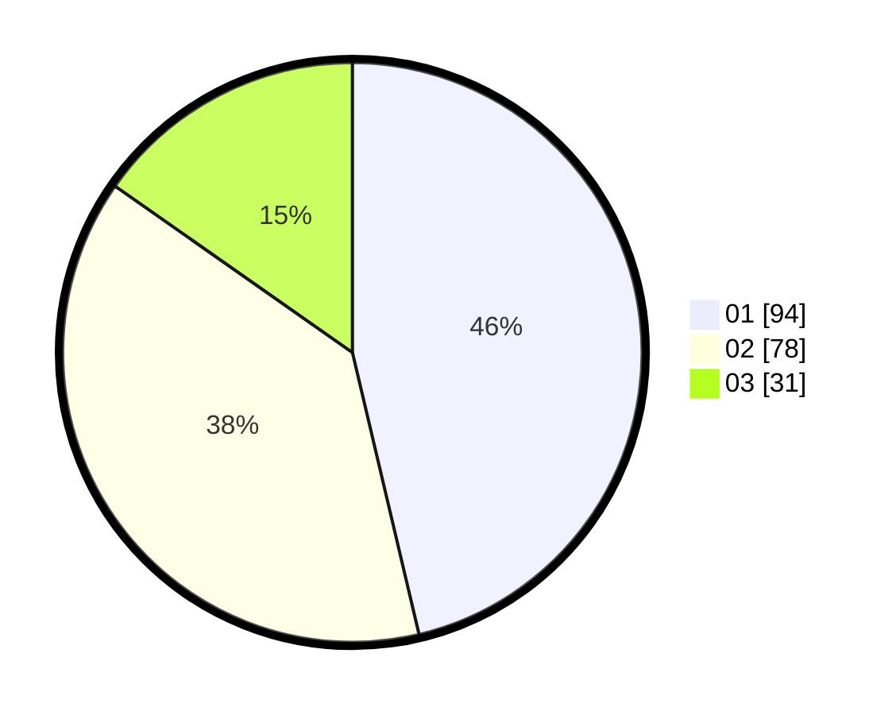

# Hasil

Hasil perolehan suara paslon dapat dilihat pada file paslon-01.txt, paslon-02.txt, dan paslon-03.txt.

Jika tidak ada, artinya data tersebut belum ada pada SIREKAP.

## Perolehan Suara

 * Paslon 01: **94**.
 * Paslon 02: **78**.
 * Paslon 03: **31**.

## Foto C Plano

https://sirekap-obj-formc.kpu.go.id/1c15/pemilu/ppwp/31/75/05/10/01/3175051001090-20240214-221254--3c668818-6a53-44ca-a74d-e10d39065c07.jpg

https://sirekap-obj-formc.kpu.go.id/1c15/pemilu/ppwp/31/75/05/10/01/3175051001090-20240214-221418--97547ed7-fde4-4e63-ac42-02ce7d7ca935.jpg

https://sirekap-obj-formc.kpu.go.id/1c15/pemilu/ppwp/31/75/05/10/01/3175051001090-20240214-221545--821c491d-bb86-422a-919d-16cf783fdfa4.jpg
