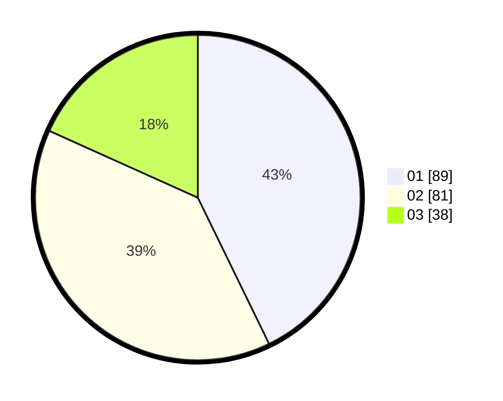

# Hasil

Hasil perolehan suara paslon dapat dilihat pada file paslon-01.txt, paslon-02.txt, dan paslon-03.txt.

Jika tidak ada, artinya data tersebut belum ada pada SIREKAP.

## Perolehan Suara

 * Paslon 01: **89**.
 * Paslon 02: **81**.
 * Paslon 03: **38**.

## Foto C Plano

https://sirekap-obj-formc.kpu.go.id/61c9/pemilu/ppwp/31/75/05/10/01/3175051001092-20240215-142032--ac947ba7-9f57-42f1-9cae-a2ff82b282a3.jpg

https://sirekap-obj-formc.kpu.go.id/61c9/pemilu/ppwp/31/75/05/10/01/3175051001092-20240215-142054--90e9984d-3ebd-4219-930c-8e8a6dc824e0.jpg

https://sirekap-obj-formc.kpu.go.id/61c9/pemilu/ppwp/31/75/05/10/01/3175051001092-20240215-142043--6b713daf-7c8c-42e3-aec7-44f85098d1b9.jpg

## DATA PEMILIH TETAP

Jumlah pemilih dalam DPT: **260**.
 * L: **130**.
 * P: **130**.

## DATA PENGGUNA HAK PILIH

Jumlah pengguna hak pilih dalam DPT: **207**.
 * L: **102**.
 * P: **105**.

Jumlah pengguna hak pilih dalam DPTb: **0**.
 * L: **0**.
 * P: **0**.

Jumlah pengguna hak pilih dalam DPK: **2**.
 * L: **1**.
 * P: **1**.

Jumlah pengguna hak pilih: **209**.
 * L: **103**.
 * P: **106**.

## JUMLAH SUARA SAH DAN TIDAK SAH

JUMLAH SELURUH SUARA SAH: **208**.

JUMLAH SUARA TIDAK SAH: **1**.

JUMLAH SELURUH SUARA SAH DAN SUARA TIDAK SAH: **209**.
