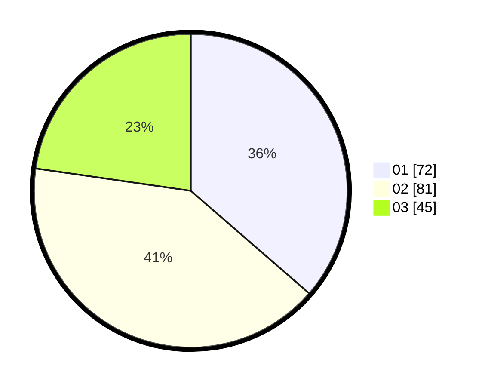

# Hasil

Hasil perolehan suara paslon dapat dilihat pada file paslon-01.txt, paslon-02.txt, dan paslon-03.txt.

Jika tidak ada, artinya data tersebut belum ada pada SIREKAP.

## Perolehan Suara

 * Paslon 01: **72**.
 * Paslon 02: **81**.
 * Paslon 03: **45**.

## Foto C Plano

https://sirekap-obj-formc.kpu.go.id/3083/pemilu/ppwp/31/75/05/10/01/3175051001098-20240214-192502--18b724c4-0a29-4179-981f-78335a9ad183.jpg

https://sirekap-obj-formc.kpu.go.id/3083/pemilu/ppwp/31/75/05/10/01/3175051001098-20240214-214849--9c0adfcc-b242-4ce0-9081-b6b6256ebfa0.jpg

https://sirekap-obj-formc.kpu.go.id/3083/pemilu/ppwp/31/75/05/10/01/3175051001098-20240214-214956--cd771e7e-7d4a-45a2-a52a-921ff74c4f7a.jpg

## DATA PEMILIH TETAP

Jumlah pemilih dalam DPT: **260**.
 * L: **123**.
 * P: **137**.

## DATA PENGGUNA HAK PILIH

Jumlah pengguna hak pilih dalam DPT: **206**.
 * L: **91**.
 * P: **115**.

Jumlah pengguna hak pilih dalam DPTb: **0**.
 * L: **0**.
 * P: **0**.

Jumlah pengguna hak pilih dalam DPK: **0**.
 * L: **0**.
 * P: **0**.

Jumlah pengguna hak pilih: **206**.
 * L: **91**.
 * P: **115**.

## JUMLAH SUARA SAH DAN TIDAK SAH

JUMLAH SELURUH SUARA SAH: **198**.

JUMLAH SUARA TIDAK SAH: **11**.

JUMLAH SELURUH SUARA SAH DAN SUARA TIDAK SAH: **209**.
