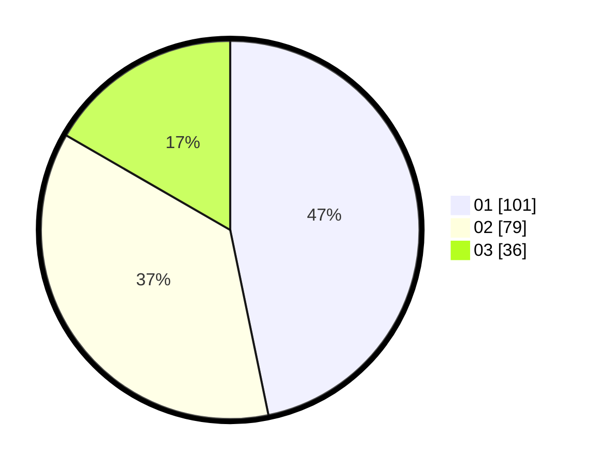

# Hasil

Hasil perolehan suara paslon dapat dilihat pada file paslon-01.txt, paslon-02.txt, dan paslon-03.txt.

Jika tidak ada, artinya data tersebut belum ada pada SIREKAP.

## Perolehan Suara

 * Paslon 01: **101**.
 * Paslon 02: **79**.
 * Paslon 03: **36**.

## Foto C Plano

https://sirekap-obj-formc.kpu.go.id/f3ed/pemilu/ppwp/31/75/05/10/01/3175051001117-20240214-192248--47b3e6ba-6615-4e7f-aec5-ca7c49ed531b.jpg

https://sirekap-obj-formc.kpu.go.id/f3ed/pemilu/ppwp/31/75/05/10/01/3175051001117-20240214-224418--41f9d403-c4b0-4efd-9d11-ccbfedd58ebb.jpg

https://sirekap-obj-formc.kpu.go.id/f3ed/pemilu/ppwp/31/75/05/10/01/3175051001117-20240214-224500--eef8bbac-f804-4e64-9d98-6c768641ab7b.jpg

## DATA PEMILIH TETAP

Jumlah pemilih dalam DPT: **271**.
 * L: **136**.
 * P: **135**.

## DATA PENGGUNA HAK PILIH

Jumlah pengguna hak pilih dalam DPT: **216**.
 * L: **104**.
 * P: **112**.

Jumlah pengguna hak pilih dalam DPTb: **0**.
 * L: **0**.
 * P: **0**.

Jumlah pengguna hak pilih dalam DPK: **1**.
 * L: **1**.
 * P: **0**.

Jumlah pengguna hak pilih: **217**.
 * L: **105**.
 * P: **112**.

## JUMLAH SUARA SAH DAN TIDAK SAH

JUMLAH SELURUH SUARA SAH: **216**.

JUMLAH SUARA TIDAK SAH: **1**.

JUMLAH SELURUH SUARA SAH DAN SUARA TIDAK SAH: **217**.
