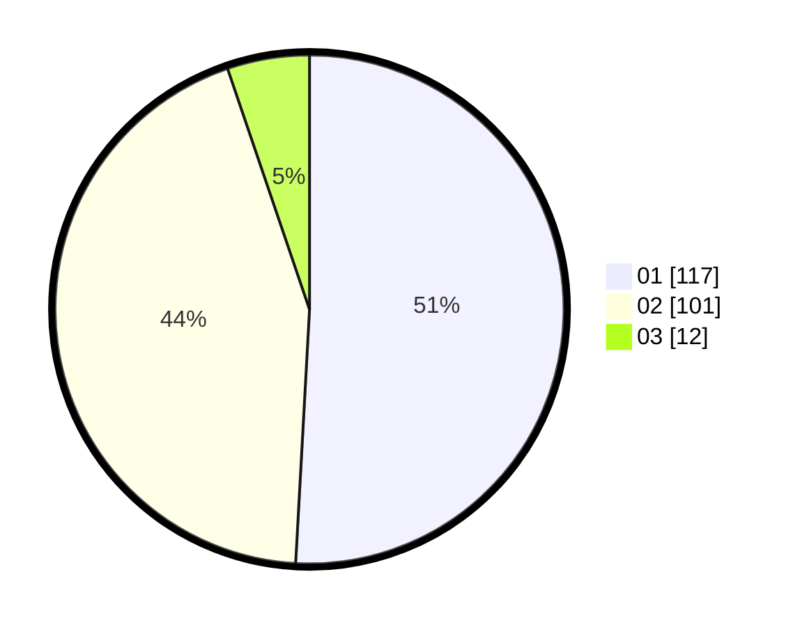

# Hasil

Hasil perolehan suara paslon dapat dilihat pada file paslon-01.txt, paslon-02.txt, dan paslon-03.txt.

Jika tidak ada, artinya data tersebut belum ada pada SIREKAP.

## Perolehan Suara

 * Paslon 01: **117**.
 * Paslon 02: **101**.
 * Paslon 03: **12**.

## Foto C Plano

https://sirekap-obj-formc.kpu.go.id/35fd/pemilu/ppwp/31/75/05/10/02/3175051002007-20240214-202823--125830b1-a605-47e2-9c0f-ea4e50d1f481.jpg

https://sirekap-obj-formc.kpu.go.id/35fd/pemilu/ppwp/31/75/05/10/02/3175051002007-20240214-202831--ed371260-bdc9-4b17-9852-152f4fd49fb6.jpg

https://sirekap-obj-formc.kpu.go.id/35fd/pemilu/ppwp/31/75/05/10/02/3175051002007-20240214-202845--e2b1496c-bbe4-438b-a616-1e90a30bc2ca.jpg

## DATA PEMILIH TETAP

Jumlah pemilih dalam DPT: **268**.
 * L: **128**.
 * P: **140**.

## DATA PENGGUNA HAK PILIH

Jumlah pengguna hak pilih dalam DPT: **225**.
 * L: **107**.
 * P: **118**.

Jumlah pengguna hak pilih dalam DPTb: **4**.
 * L: **1**.
 * P: **3**.

Jumlah pengguna hak pilih dalam DPK: **1**.
 * L: **0**.
 * P: **1**.

Jumlah pengguna hak pilih: **230**.
 * L: **108**.
 * P: **122**.

## JUMLAH SUARA SAH DAN TIDAK SAH

JUMLAH SELURUH SUARA SAH: **230**.

JUMLAH SUARA TIDAK SAH: **0**.

JUMLAH SELURUH SUARA SAH DAN SUARA TIDAK SAH: **230**.
