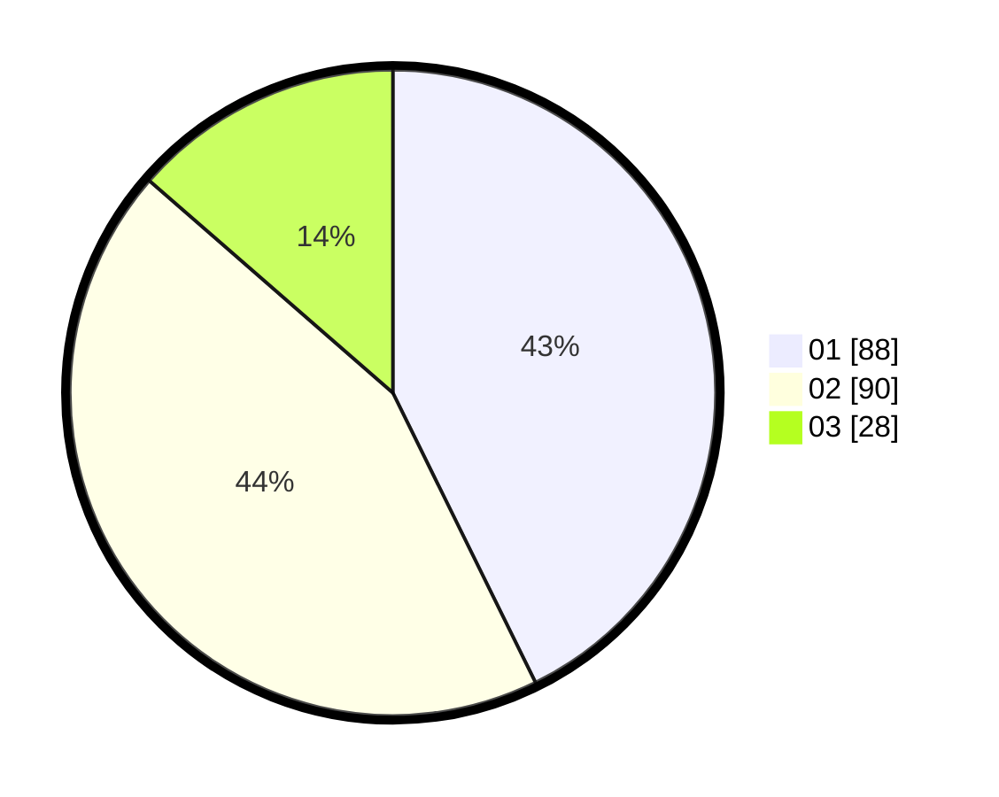

# Hasil

Hasil perolehan suara paslon dapat dilihat pada file paslon-01.txt, paslon-02.txt, dan paslon-03.txt.

Jika tidak ada, artinya data tersebut belum ada pada SIREKAP.

## Perolehan Suara

 * Paslon 01: **88**.
 * Paslon 02: **90**.
 * Paslon 03: **28**.

## Foto C Plano

https://sirekap-obj-formc.kpu.go.id/206c/pemilu/ppwp/31/75/05/10/02/3175051002011-20240214-210528--393a6c1a-83e6-4336-8579-57b2ea28befd.jpg

https://sirekap-obj-formc.kpu.go.id/206c/pemilu/ppwp/31/75/05/10/02/3175051002011-20240215-001521--cb5a4792-6371-4481-a823-e2529a5a93f9.jpg

https://sirekap-obj-formc.kpu.go.id/206c/pemilu/ppwp/31/75/05/10/02/3175051002011-20240215-001634--13aa66aa-add2-4865-b6f3-24bcfb0ad005.jpg
