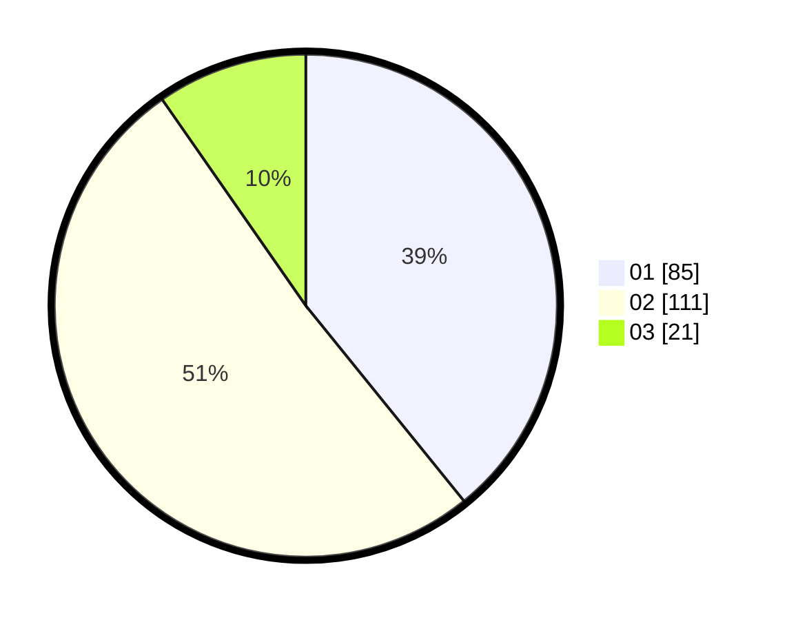

# Hasil

Hasil perolehan suara paslon dapat dilihat pada file paslon-01.txt, paslon-02.txt, dan paslon-03.txt.

Jika tidak ada, artinya data tersebut belum ada pada SIREKAP.

## Perolehan Suara

 * Paslon 01: **85**.
 * Paslon 02: **111**.
 * Paslon 03: **21**.

## Foto C Plano

https://sirekap-obj-formc.kpu.go.id/fc97/pemilu/ppwp/31/75/05/10/02/3175051002012-20240215-004523--a60c6fe2-dd3e-42a5-a8d4-40d04e5c5494.jpg

https://sirekap-obj-formc.kpu.go.id/fc97/pemilu/ppwp/31/75/05/10/02/3175051002012-20240215-004526--3954c130-2861-4057-a9ed-d4186db55c1a.jpg

https://sirekap-obj-formc.kpu.go.id/fc97/pemilu/ppwp/31/75/05/10/02/3175051002012-20240215-021721--b6b39ddd-9773-4dcb-b87c-e9d79973bd24.jpg
