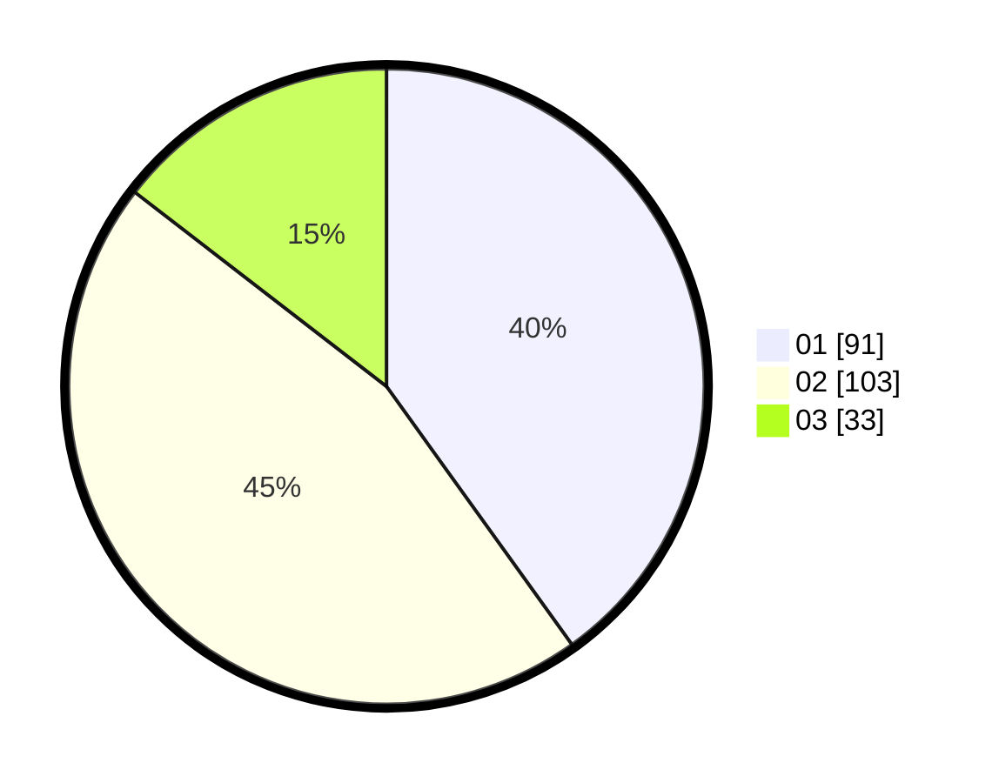

# Hasil

Hasil perolehan suara paslon dapat dilihat pada file paslon-01.txt, paslon-02.txt, dan paslon-03.txt.

Jika tidak ada, artinya data tersebut belum ada pada SIREKAP.

## Perolehan Suara

 * Paslon 01: **91**.
 * Paslon 02: **103**.
 * Paslon 03: **33**.

## Foto C Plano

https://sirekap-obj-formc.kpu.go.id/7e12/pemilu/ppwp/31/75/05/10/02/3175051002019-20240214-191855--a3a030d0-a870-416f-811a-0675b3065b0a.jpg

https://sirekap-obj-formc.kpu.go.id/7e12/pemilu/ppwp/31/75/05/10/02/3175051002019-20240214-200643--9810d7a5-1a56-4892-866e-b131219f088d.jpg

https://sirekap-obj-formc.kpu.go.id/7e12/pemilu/ppwp/31/75/05/10/02/3175051002019-20240214-205006--0139f9b9-1151-4a58-8c57-0c0200d68a72.jpg

## DATA PEMILIH TETAP

Jumlah pemilih dalam DPT: **230**.
 * L: **104**.
 * P: **126**.

## DATA PENGGUNA HAK PILIH

Jumlah pengguna hak pilih dalam DPT: **227**.
 * L: **102**.
 * P: **125**.

Jumlah pengguna hak pilih dalam DPTb: **0**.
 * L: **0**.
 * P: **0**.

Jumlah pengguna hak pilih dalam DPK: **3**.
 * L: **2**.
 * P: **1**.

Jumlah pengguna hak pilih: **230**.
 * L: **104**.
 * P: **126**.

## JUMLAH SUARA SAH DAN TIDAK SAH

JUMLAH SELURUH SUARA SAH: **227**.

JUMLAH SUARA TIDAK SAH: **3**.

JUMLAH SELURUH SUARA SAH DAN SUARA TIDAK SAH: **230**.
